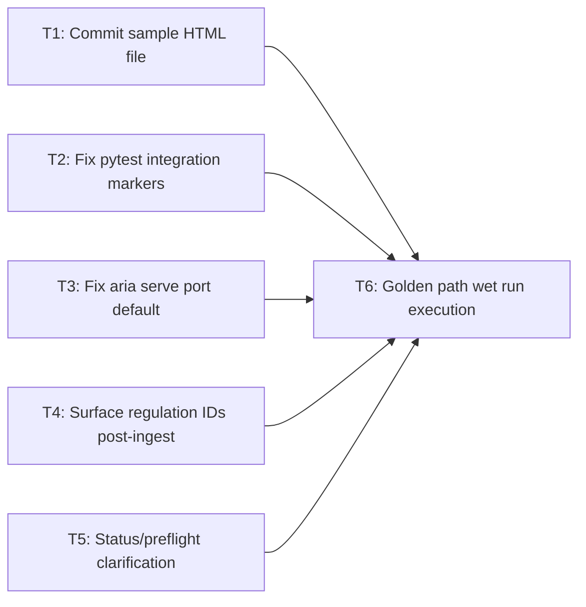
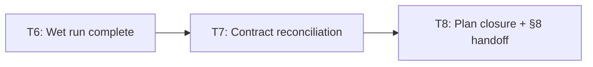

# Plan — mvp-phase1-golden-wet-run

**Plan version:** 1.1  
**Status:** Active — audit remediation pending (T7–T8)  
**Produced by:** orchestrator-planning v0.6  
**Plan date:** 2026-05-25  
**Packets:** `.dev/plans/mvp-phase1-golden-wet-run/packets/T{1..8}.md`  
**Decision log (T6):** `.dev/decision-logs/T6-wet-run.md`

---

## §0 Context map intake

**Path consumed:** `.dev/plans/mvp-phase1-golden-wet-run/context-map.md`  
*(Promoted from `.dev/plans/_pending/mvp-phase1-golden-wet-run/context-map.md` per path-discipline rule.)*

**Skill version + commit SHA at map generation:**  
pre-plan-exploration v0.2 · ee87002297a495389b9bc79a510966dd30ab23f7

**Readiness verdict:** CONDITIONAL

**Scope-area labels flagged in §Ambiguity flags:**

| Flag | Category | Scope area |
|------|----------|-----------|
| Flag 1 | vocabulary_collision | pytest / verification scope |
| Flag 2 | missing_test_coverage | ingest / query scope |
| Flag 3 | ownership_ambiguity | impact scope |
| Flag 4 | coexisting_model_versions | ingest fallback vs golden path |
| Flag 5 | vocabulary_collision | status vs ingest preflight |
| Flag 6 | missing_test_coverage | CLI execution / fixes |

**CONDITIONAL ruling:** Planning proceeds. Per §5.2, each flagged ambiguity is addressed. Any subtask whose scope-area label matches a flagged ambiguity carries a kill criterion: "halt if context-map flag \<N\> is unresolved at execution start."

**Binding artifacts:**  
The context map at `.dev/plans/mvp-phase1-golden-wet-run/context-map.md` is a tracked path (to be committed). It is the sole binding pre-plan artifact. All §2 contracts and §4 specs are grounded in it; no out-of-tree documents are cited as binding.

---

## §1 Task statement

Phase 1 of the Aria MVP is a one-session golden-path wet run that proves the end-to-end live stack operates correctly. The session exercises the full Phase 1 command sequence — `docker compose up -d neo4j chromadb`, `ARIA_PLACEHOLDER_API=false`, then `aria init` → `aria ingest <sample>` → `aria query` → `aria impact <id>` → `aria telemetry` → optional `aria serve` + curl → `pytest tests/integration -m integration` — records every failure inline in `.dev/MVP_PICKUP.md`'s wet run log, applies minimal targeted fixes for each blocker, and concludes with a signed-off confirmation that `aria ingest` preflight (Neo4j + Chroma + LLM all required) is strictly more demanding than `/ready` (LLM optional).

Five pre-run blockers identified by the context map (Flags 1–5) are resolved in dedicated subtasks before the wet run executes (T1–T5). T6 is the execution subtask itself.

**Non-goals:**

- Phases 2–6 of MVP_PICKUP.md (eval/honesty, observability, product defaults, UX).
- HTTP-level ingest (`POST /ingest/*`) — golden path is the services layer.
- Comprehensive `CliRunner` live-path test suites (Flag 6 deferred).
- Refactoring any existing service beyond the minimal change that unblocks Phase 1.
- Production hardening, load testing, or persistence guarantees.
- Changing or auditing the scratch orchestration layer (`aria/orchestration/scratch/`).

---

## §2 Shared contracts

**Decision log path (T6, architectural):** `.dev/decision-logs/T6-wet-run.md`  
*(This path is a contract anchor. Any reference to other paths under `.dev/decision-logs/` for T6 output is a retired-string target.)*

### Types / interfaces

| Surface | Owner | Typed path | Round-trip / construction test |
|---------|-------|-----------|-------------------------------|
| `serve` `--port` default | T3 | `aria/cli/commands/serve.py` · Typer `Option` default reads `int(os.getenv("API_PORT", "8080"))` via `default_factory` or env read in function body | Deferred to T3 kill criterion: manual invocation confirms port; no automated test required for Phase 1 |
| `aria ingest` stdout — regulation ID line | T4 | `aria/cli/commands/ingest.py` · `_ingest_async` post-result block; output format: `"  regulation_ids: <comma-separated>"` | No separate test; wet run (T6) observes output live |
| `@pytest.mark.integration` on `tests/integration/` | T2 | `tests/integration/test_end_to_end.py`, `tests/integration/test_ingestion_pipeline.py`; marker registered in `pyproject.toml` | `pytest tests/integration -m integration` collects ≥ 1 test |
| `tests/fixtures/sample_regulation.html` | T1 | Committed HTML file; path frozen as contract anchor for T6 ingest step | `aria ingest tests/fixtures/sample_regulation.html` exits 0 in T6 |

### Error envelope

No HTTP wire changes in this plan. `aria ingest` exits `1` on preflight failure (neo4j OR chroma OR llm missing) — unchanged. `aria serve` startup failure on port conflict is an OS-level error; T3 avoids it via env-based default. `ServiceUnavailableBody` (Surface 4 in context map) is not modified.

### Naming

| New symbol / path | Owner |
|-------------------|-------|
| `tests/fixtures/sample_regulation.html` | T1 |
| `.dev/decision-logs/T6-wet-run.md` | T6 |

No new Python modules introduced.

### Logging

- `aria ingest` on `SUCCESS`: appends `"  regulation_ids: <comma-separated IDs>"` line to stdout (or `"  regulation_ids: (none — Regulation nodes not found)"` if graph returned zero). T4 owns.
- `aria status` output: adds a visible note that LLM health is optional for `aria status` exit code (exit 0 even if LLM fails), but is **required** for `aria ingest`. T5 owns.
- No new structured telemetry fields.

### Tests

- Framework: pytest with `pytest-asyncio`.
- Integration marker: `@pytest.mark.integration` (already registered in `pyproject.toml`; description updated by T2 to reflect that some tests in `tests/integration/` are infrastructure-free).
- Target command: `pytest tests/integration -m integration` must collect and pass ≥ 1 test after T2.
- No new test files created by T1–T5. T6 may add minimal smoke if newly discovered regressions require fast signal.

### CLI surface (frozen)

| Command | Frozen form | Owner of change | Consuming subtask |
|---------|------------|----------------|------------------|
| `aria ingest <file> [--force] [--skip-schema]` | Unchanged | — | T6 |
| `aria serve [--host] [--port] [--reload]` | `--port` default: `int(os.getenv("API_PORT", "8080"))` | T3 | T6 |
| `aria query <question> [--regulation-id] [--graph-rag/--no-graph-rag] [--top-k] [--json]` | Unchanged | — | T6 |
| `aria impact <regulation_id> [--json]` | Unchanged | — | T6 |
| `aria telemetry [--since] [--hours]` | Unchanged | — | T6 |
| `pytest tests/integration -m integration` | Must pass after T2 | T2 | T6 |
| `docker compose up -d neo4j chromadb` | Unchanged | — | T6 |

---

## §3 Dependency DAG



**Parallel group {T1, T2, T3, T4, T5}:** All independent; none touches the same file or interface as another. All must complete before T6 starts.

**T6** has hard dependencies on all five; it is the only sequential node.

---

## §4 Subtask specs

---

### T1 — Commit sample HTML file

| Field | Content |
|-------|---------|
| **ID** | T1 |
| **Scope** | Add a committed sample HTML regulatory document (`tests/fixtures/sample_regulation.html`) that `aria ingest` can consume during the wet run. Resolves Flag 2. |
| **Files to touch** | `tests/fixtures/sample_regulation.html` (create) |
| **Contract bindings** | Naming: path `tests/fixtures/sample_regulation.html` is frozen. Types/interfaces: HTML file must be parseable by `aria/ingestion/parsers/html_parser.py` (generic BeautifulSoup-parseable HTML). |
| **Inputs** | None |
| **Outputs** | `tests/fixtures/sample_regulation.html` — minimal HTML with regulation title (`<title>` tag), at least two `<h1>`/`<h2>` headings, and multi-sentence paragraphs plausible for chunking. |
| **Kill criteria** | Halt if inspection of `aria/ingestion/parsers/html_parser.py` reveals it requires a non-generic HTML structure (e.g. a specific CSS class or custom attribute) that the sample does not provide. Fix by matching the required structure before committing. |
| **Log tier** | trivial |
| **Risks & mitigations** | HTML parser may derive `title` from `<title>` tag only; include it. Chunker needs sufficient text (≥ 3 sentences per section) to produce chunks; include plausible regulatory prose. |

---

### T2 — Fix pytest integration markers

| Field | Content |
|-------|---------|
| **ID** | T2 |
| **Scope** | Apply `@pytest.mark.integration` at the class or module level in `tests/integration/test_end_to_end.py` and `tests/integration/test_ingestion_pipeline.py`. Update `pyproject.toml` marker description to reflect that the `integration` marker covers both infrastructure-requiring and infrastructure-free tests. Resolves Flag 1. |
| **Files to touch** | `tests/integration/test_end_to_end.py`, `tests/integration/test_ingestion_pipeline.py`, `pyproject.toml` |
| **Contract bindings** | Tests contract: marker name `integration`, command `pytest tests/integration -m integration` collects ≥ 1 test. |
| **Inputs** | None |
| **Outputs** | Both test files with `@pytest.mark.integration` applied. `pyproject.toml` with updated marker description. Changelog entry. |
| **Kill criteria** | (a) Halt if `test_end_to_end.py` or `test_ingestion_pipeline.py` fail when run with `pytest tests/integration -m integration` — fix the test failures before marking complete. (b) Halt if context-map flag 1 is unresolved at execution start. |
| **Log tier** | standard |
| **Risks & mitigations** | The existing marker description (`"requires running Neo4j and ChromaDB"`) implies live-infra-only tests. CI pipelines that run `pytest -m "not integration"` to exclude live tests will now also exclude these infrastructure-free tests, potentially reducing coverage in dry runs. Mitigation: update the marker description to `"integration-level tests; subset requires running Neo4j and ChromaDB"`. Flag in changelog for CI maintainer. |

---

### T3 — Fix aria serve port default

| Field | Content |
|-------|---------|
| **ID** | T3 |
| **Scope** | Change `aria/cli/commands/serve.py` so the `--port` default reads the `API_PORT` environment variable, falling back to `8080` when unset. Resolves Surface 6 (Chroma occupies port 8000; `aria serve` defaults to same port). |
| **Files to touch** | `aria/cli/commands/serve.py` |
| **Contract bindings** | CLI surface: `aria serve --port` default is now env-derived (`int(os.getenv("API_PORT", "8080"))`). Types/interfaces: Typer `Option` for `port`. |
| **Inputs** | None |
| **Outputs** | Modified `aria/cli/commands/serve.py`. Changelog entry. |
| **Kill criteria** | Halt if Typer's `Option` does not accept a `default_factory` or callable default cleanly. In that case, read `API_PORT` inside the function body and use it as the effective port, leaving the Typer default as `8080` literal. |
| **Log tier** | standard |
| **Risks & mitigations** | Typer CLI `--help` will show `8080` as the default (or a callable description if using `default_factory`). Mitigation: add `help` text noting `API_PORT` env override: `"Listen port (overridden by API_PORT env var)."` |

---

### T4 — Surface regulation IDs post-ingest

| Field | Content |
|-------|---------|
| **ID** | T4 |
| **Scope** | Modify `aria/cli/commands/ingest.py` to print regulation IDs found in the Neo4j graph after a successful ingest. This gives the operator a concrete ID to pass to `aria impact <id>`. Resolves Flag 3. |
| **Files to touch** | `aria/cli/commands/ingest.py` |
| **Contract bindings** | Logging: stdout line `"  regulation_ids: <comma-separated>"` (or `"  regulation_ids: (none — Regulation nodes not found)"`) after `_print_result`. CLI surface: `aria ingest` stdout format extended. |
| **Inputs** | None (uses `neo` connection already established in `_ingest_async`) |
| **Outputs** | Modified `aria/cli/commands/ingest.py`: new async helper (e.g. `_fetch_regulation_ids(neo)`) that runs `MATCH (r:Regulation) RETURN r.id AS id` via `neo.execute_read`; called after `_print_result` when `result.graph_written` is true. Changelog entry. |
| **Kill criteria** | (a) Halt if `Neo4jClient.execute_read` does not accept a plain Cypher string and return iterable records with dict-like access — inspect `aria/graph/client.py` signature before implementing; adapt call if needed. (b) Halt if context-map flag 3 is unresolved at execution start. |
| **Log tier** | standard |
| **Risks & mitigations** | Entity extractor assigns regulation IDs dynamically at LLM runtime; may return zero nodes if extraction produced no `Regulation` entities. Mitigation: print the `(none — Regulation nodes not found)` warning rather than an error; operator can fall back to `seed_graph.py` IDs (`reg-gdpr`, `reg-eu-ai-act`) for the impact step. Document this fallback in the status message. |

---

### T5 — Status/preflight clarification message

| Field | Content |
|-------|---------|
| **ID** | T5 |
| **Scope** | Add a visible note to `aria status` output clarifying that `aria status` can exit 0 even when LLM is unhealthy, but `aria ingest` requires LLM. Operator confusion risk (Flag 5). Output-only change; no logic modification. |
| **Files to touch** | `aria/cli/commands/status.py` |
| **Contract bindings** | Logging: status output message extended with one line. No CLI surface change. |
| **Inputs** | None |
| **Outputs** | Modified `aria/cli/commands/status.py` with a footer note such as `"Note: aria ingest also requires LLM (above). aria status exits 0 if only LLM is unavailable."` Changelog entry. |
| **Kill criteria** | Halt if `aria status` output is structured (e.g. JSON-only when `--json` passed) and the note cannot be added without breaking JSON consumers; in that case, add the note only when `--json` is not passed. |
| **Log tier** | trivial |
| **Risks & mitigations** | None material. |

---

### T6 — Golden path wet run execution

| Field | Content |
|-------|---------|
| **ID** | T6 |
| **Scope** | Execute the full Phase 1 golden-path session end-to-end with `ARIA_PLACEHOLDER_API=false`. Record every failure and fix inline in `.dev/MVP_PICKUP.md` wet run log. Fix newly discovered blockers minimally (≤ 3 files per blocker; escalate if larger). Confirm `aria ingest` preflight strictly requires LLM while `/ready` does not. Produce decision log at `.dev/decision-logs/T6-wet-run.md`. |
| **Files to touch** | `.dev/MVP_PICKUP.md` (wet run log, lines 249–268), `.dev/decision-logs/T6-wet-run.md` (create; architectural log required), any fix files discovered inline (documented per fix in wet run log) |
| **Contract bindings** | All §2 contracts. CLI surface (all Phase 1 commands). Tests contract (`pytest tests/integration -m integration` must pass). Decision log path: `.dev/decision-logs/T6-wet-run.md`. |
| **Inputs** | T1 (path `tests/fixtures/sample_regulation.html` exists), T2 (`pytest tests/integration -m integration` selects ≥ 1 test), T3 (`aria serve` default port is 8080), T4 (`aria ingest` prints regulation IDs), T5 (`aria status` carries preflight clarification note) |
| **Outputs** | (1) `.dev/MVP_PICKUP.md` wet run log completed (all fields filled, sign-off Y/N recorded). (2) `.dev/decision-logs/T6-wet-run.md` with alternatives considered, decisions made, and any inline fix rationale. (3) Inline fix commits for any newly discovered blockers (referenced by commit SHA in wet run log). (4) Assertion in log: `aria ingest` preflight exits 1 when LLM unreachable; `GET /ready` returns 200 with `llm: false` under same conditions. |
| **Kill criteria** | (a) Halt and record in wet run log if `docker compose up -d neo4j chromadb` services are not healthy within 60 s. (b) Halt and record if `aria init` raises an unhandled exception (not a user-facing error message). (c) Halt and record if `aria ingest` LLM preflight never resolves after 120 s (indicates LLM env not configured; fix LLM config or document as environment blocker). (d) Halt and record if `aria query` raises an unhandled Python exception — this is a structural bug, not a data gap; fix before continuing. (e) If any inline fix requires touching > 3 files outside the §2 file list, halt, document the finding in the wet run log, and flag for re-plan. (f) T2 must be complete before running `pytest tests/integration -m integration` step. |
| **Log tier** | architectural |
| **Risks & mitigations** | (1) **LLM timeout** (Surface 1, context map §Orchestrator handoff): `probe_llm_reachable` has a 12 s timeout; orchestration timeout is separate. Mitigation: verify `LLM_*` env vars or Ollama is running before starting the session; document the LLM endpoint in the wet run log header. (2) **`seed_corpus.py` shortcut** (Flag 4): Do NOT use `scripts/seed_corpus.py` as the primary ingest path — it skips `build_full_ingest_wiring` (no entity extraction, no graph write, no vector index), leaving `aria query` and `aria impact` ungrounded. Use `aria ingest tests/fixtures/sample_regulation.html`. (3) **Regulation ID mismatch** (Flag 3, Surface 7): Entity extractor may assign IDs that differ from `seed_graph.py` hard-coded IDs (`reg-gdpr`, `reg-eu-ai-act`). Mitigation: use the IDs printed by T4's modification of `aria ingest`, not the seed IDs. (4) **Neo4j schema from init**: Run `aria init` before `aria ingest`; or pass `--skip-schema` only if schema was previously applied (document in log). |

---

## §5 Adversarial pass

### §5.1 Rejected decompositions

1. **Single "fix everything in one subtask" approach.** Rejected because blockers T1–T5 are independent; a single task has no granular kill criteria and cannot be executed in parallel. Subtask boundaries enable parallel execution and precise failure attribution.

2. **Add comprehensive CliRunner live-path tests (Flag 6) as a T1–T5 prerequisite.** Rejected. Phase 1 is a one-day wet run with minimal fixes. Comprehensive CLI live-path tests are deferred (explicit non-goal). Adding them before the wet run would extend the session beyond scope and could introduce new failures that obscure the golden path.

3. **Change the Phase 1 pytest command to `pytest tests/eval/e2e -m integration` (use the file that already has the marker).** Plausible but rejected: it changes the documented Phase 1 command line, deviating from MVP_PICKUP.md. Preferred approach is to bring the documented command into alignment by adding markers to `tests/integration/` (T2). If T2's kill criterion fires, this alternative becomes the fallback action documented in T2's risks.

4. **Merge T3 and T5 into T6 as inline wet-run fixes.** Rejected. T3 (port conflict) would block `aria serve` before the operator can even attempt the optional step. T5 is trivially independent. Both are safer resolved before the wet run starts.

### §5.2 Load-bearing assumptions

```
(tests/integration/*.py use mocked or no external services |
 §2 Tests: @pytest.mark.integration on tests/integration/;
 pyproject.toml marker "requires running Neo4j and ChromaDB" |
 marking them `integration` causes CI to attempt live-infra runs
   which fail in dry CI | T2)
```

```
(html_parser.py accepts generic HTML with <title>, <h1>, <p> tags |
 §2 Types/interfaces: sample_regulation.html parseable by html_parser.py |
 aria ingest fails with PARSE_ERROR on the committed sample file | T1, T6)
```

```
(Neo4jClient.execute_read accepts a plain Cypher string and returns
   iterable records with dict-like access |
 §2 Types/interfaces: Neo4jClient interface inventory "execute_read/write" |
 T4 cannot implement regulation ID discovery; kill criterion fires | T4)
```

```
(entity extractor creates Regulation nodes with a queryable .id property
   during aria ingest with full wiring |
 §2 Logging: "  regulation_ids: <comma-separated>" line from T4 |
 T4 prints (none) warning; T6 impact step must fall back to seed IDs | T4, T6)
```

```
(LLM is reachable during wet run — Ollama running or LLM_* cloud env set |
 §2 CLI surface: aria ingest requires LLM preflight (all three services) |
 aria ingest exits 1; entire golden path stalls at ingest step | T6)
```

```
(Typer Option for serve port can accommodate an env-derived default cleanly |
 §2 CLI surface: serve --port default reads API_PORT env, fallback 8080 |
 T3 implementation requires reading env in function body instead;
   help text shows literal 8080 rather than env note | T3, T6)
```

### §5.3 Highest re-plan risk

**T6** (golden path wet run). The LLM reachability failure mode is the single most likely surprise: if `probe_llm_reachable` times out, `aria ingest` exits 1 and the entire golden path stalls. Additionally, if entity extraction succeeds but produces zero `Regulation` nodes (e.g. due to LLM response schema mismatch), `aria impact` has no valid ID to use — the operator must fall back to `seed_graph.py` IDs or document the path as partially grounded.

Process risk: T4's regulation-ID output depends on Neo4j storing `Regulation` nodes with an `id` property in the exact form the Cypher query returns. If the property key differs (e.g. `regulation_id` vs `id`), T4's output is empty and T6 records a warning. This is recoverable in-session but should be flagged immediately.

### §5.4 Hidden couplings

```
confirmed |
(Chroma port 8000 vs aria serve default 8000 |
 §2 CLI surface: aria serve --port default changes to 8080 after T3 |
 both services bind 8000; aria serve startup fails with AddressInUse |
 T3, T6)
```

```
confirmed |
(pytest -m "not integration" CI gate excludes tests/integration/ after T2 |
 §2 Tests: @pytest.mark.integration applied to test_end_to_end.py,
   test_ingestion_pipeline.py |
 tests that previously ran in dry CI are now filtered out, reducing
   non-live coverage silently | T2)
```

```
suspected |
(entity extractor regulation ID key name differs from "id" |
 §2 Logging: T4 Cypher query MATCH (r:Regulation) RETURN r.id AS id |
 _fetch_regulation_ids returns empty; T6 impact step prints "(none)" |
 T4, T6)
Disproven by: inspecting aria/agents/graph_builder.py or aria/contracts/regulation.py
  to confirm Regulation node property key is "id".
```

```
confirmed |
(seed_corpus.py ingest bypasses full wiring |
 §2 Types/interfaces: ingest_document call in seed_corpus.py lacks
   entity_extractor/graph_writer/vector_indexer args |
 wet run appears to ingest successfully but query/impact return empty |
 T6)
```

```
suspected |
(test_end_to_end.py imports aria.orchestration.scratch.graph — excluded scope |
 §2 Tests: @pytest.mark.integration on TestAPIEndpoints, TestContractToGraphFlow,
   TestOrchestrationFlow classes |
 if scratch orchestration modules have import-time errors after any
   in-session fix, test collection fails | T2, T6)
Disproven by: running pytest --collect-only tests/integration/ after T2 to confirm
  collection succeeds before T6 starts.
```

---

## §6 Executor packets

Packets saved to `.dev/plans/mvp-phase1-golden-wet-run/packets/`:

| Packet | Path |
|--------|------|
| T1 | `.dev/plans/mvp-phase1-golden-wet-run/packets/T1.md` |
| T2 | `.dev/plans/mvp-phase1-golden-wet-run/packets/T2.md` |
| T3 | `.dev/plans/mvp-phase1-golden-wet-run/packets/T3.md` |
| T4 | `.dev/plans/mvp-phase1-golden-wet-run/packets/T4.md` |
| T5 | `.dev/plans/mvp-phase1-golden-wet-run/packets/T5.md` |
| T6 | `.dev/plans/mvp-phase1-golden-wet-run/packets/T6.md` |

Each packet is self-contained (§1 verbatim, §2 verbatim, subtask block verbatim, filtered §5.2/§5.4, resolved inputs).

---

## §7 Amendment subtasks

*Amendment v1.1 fired 2026-05-30 per audit `.dev/audits/2026-05-30-mvp-phase1-golden-wet-run.md` (verdict: **fail** on majors F-02, F-03, F-07). Original T1–T6 specs above are unchanged. Remediation subtasks below close audit majors and populate §8.*

**Packet paths:** `.dev/plans/mvp-phase1-golden-wet-run/packets/T7.md`, `T8.md`

---

### T7 — Audit contract reconciliation (F-02, F-03, F-04, F-05, F-06)

| Field | Content |
|-------|---------|
| **ID** | T7 |
| **Scope** | Back-annotate shared contracts with *Landed:* deltas so shipped unit tests and stdout literals are binding without reverting beneficial coverage. Acknowledge T3/T5 test files in CHANGELOG. No code changes unless executor discovers shipped strings diverge from audit evidence at HEAD. |
| **Files to touch** | `.dev/plans/mvp-phase1-golden-wet-run/plan.md` (append §2 Amendment — contract deltas only), `CHANGELOG.md` |
| **Contract bindings** | §2 Amendment block (this section's *Landed:* rows). Tests: frozen unit file paths. Logging: frozen stdout literals. |
| **Inputs** | T1–T6 complete; audit file `.dev/audits/2026-05-30-mvp-phase1-golden-wet-run.md` |
| **Outputs** | (1) §2 Amendment — contract deltas appended to plan (see v1.1 block below). (2) CHANGELOG entry naming `tests/unit/test_serve.py` (T3) and `tests/unit/test_status.py` (T5) alongside existing T4 test note. (3) Changelog entry for v1.1 amendment. |
| **Kill criteria** | (a) Halt if any of the three unit test files are absent at HEAD — report path and commit that removed them. (b) Halt if shipped stdout in `status.py` or `ingest.py` differs from audit-cited literals and reconciliation requires a code change touching > 1 file — escalate to orchestrator. (c) Halt if amendment edits any prose in §1–§6 above (only append §2 Amendment block and CHANGELOG). |
| **Log tier** | standard |
| **Risks & mitigations** | Narrative-only drift is low risk. Mitigation: copy literals from HEAD `status.py` L19–20 and `ingest.py` L108–110, not from original §2/T5 spec quotes. |

---

### T8 — Plan closure and §8 auditor handoff (F-07, F-01)

| Field | Content |
|-------|---------|
| **ID** | T8 |
| **Scope** | Mark plan **Complete**; populate §8 auditor handoff at closure SHA. Refresh context map at HEAD to close F-01 staleness. Commit audit artifact if untracked. |
| **Files to touch** | `.dev/plans/mvp-phase1-golden-wet-run/plan.md` (Status → Complete; populate §8), `.dev/plans/mvp-phase1-golden-wet-run/context-map.md` (re-scout in-scope paths), `.dev/audits/2026-05-30-mvp-phase1-golden-wet-run.md` (commit if untracked) |
| **Contract bindings** | §8 auditor handoff schema (orchestrator-planning v0.6 §8). Context map SHA must match closure SHA. |
| **Inputs** | T7 (§2 Amendment block landed) |
| **Outputs** | (1) Plan Status **Complete**. (2) §8.1–§8.6 populated (§8.6 present — links audit + T7 amendment). (3) Context map updated with HEAD SHA and post-execution file notes. (4) *Complete* banner in plan header. |
| **Kill criteria** | (a) Halt if T7 §2 Amendment block is missing from plan. (b) Halt if §8.1 verification is run on a dirty working tree — stash or commit unrelated changes first, then run on clean checkout of closure SHA. (c) Halt if any §8.2 path fails `git show HEAD:<path>`. (d) Halt if context-map flag IDs 1–5 still describe pre-T1–T6 state without a staleness note. |
| **Log tier** | standard |
| **Risks & mitigations** | Closure SHA may differ from audit SHA `d448a310` if T7/T8 commits land. Mitigation: record actual closure SHA in §8.1, not the audit SHA. F-08 (wet-run replay automation) remains deferred — mark **open** in §8.4, non-blocking. |

---

## §8 Auditor handoff

*Populated by T8 upon plan closure. Draft evidence below reflects audit-time HEAD `d448a310`; T8 executor must re-run §8.1 on clean checkout at closure SHA.*

---

## Plan v1.1 — amendment extension (2026-05-30)

**Audit consumed:** `.dev/audits/2026-05-30-mvp-phase1-golden-wet-run.md`  
**Audit verdict:** fail — majors F-02, F-03, F-07 must close before merge-closure  
**Non-goals (amendment):** Revert unit tests; implement wet-run replay script (F-08); invalid `API_PORT` error handling (deferred in changelog); Phase 2+ scope.

### §3 Amendment dependency DAG



**Sequential:** T7 then T8. No parallel group.

### §2 Amendment — contract deltas (*Landed:* — T7)

*These rows supersede conflicting prose in §2 above where noted. Do not edit original §2 rows.*

#### Tests (*Landed:* — closes F-02, F-03)

| Surface | Owner | Path | Verification |
|---------|-------|------|--------------|
| `aria serve` port default + `API_PORT` | T3 | `tests/unit/test_serve.py` | `pytest tests/unit/test_serve.py` — 4 tests |
| `aria ingest` regulation ID stdout + `_fetch_regulation_ids` | T4 | `tests/unit/test_ingest_command.py` | `pytest tests/unit/test_ingest_command.py` — 5 tests |
| `aria status` ingest/LLM note | T5 | `tests/unit/test_status.py` | `pytest tests/unit/test_status.py` — 2 tests |

*Supersedes §2 Tests row "No new test files created by T1–T5." T6 may still add minimal smoke; these three files are T3–T5 contract anchors.*

#### Logging (*Landed:* — closes F-04, F-05)

| Surface | Owner | Binding literal |
|---------|-------|-----------------|
| `aria status` footer note | T5 | `"Note: aria ingest additionally requires LLM. aria status exits 0 even when LLM is unavailable."` |
| `aria ingest` regulation_ids (none branch) | T4 | `"  regulation_ids: (none — Regulation nodes not found; use seed_graph.py IDs or check entity extractor)"` |
| `aria ingest` regulation_ids (success branch) | T4 | `"  regulation_ids: <comma-separated>"` (unchanged) |

*Supersedes T5 spec suggested text and §2 Logging/T4 `(none — Regulation nodes not found)` suffix-less form.*

#### Types / interfaces (*Landed:* — closes F-06)

| Surface | Owner | Typed path | Round-trip / construction test |
|---------|-------|-----------|-------------------------------|
| `aria ingest` stdout — regulation ID line | T4 | `aria/cli/commands/ingest.py` | `tests/unit/test_ingest_command.py` (replaces "No separate test; wet run observes live") |

### §5 Amendment — adversarial disposition

**Rejected decomposition:** Revert `tests/unit/test_{serve,ingest_command,status}.py` to satisfy original §2 prohibition. Rejected — tests pass (11/11), add meaningful signal; audit recommends amendment over revert.

**Load-bearing assumption (T7):**
```
(Shipped stdout literals in status.py and ingest.py match audit evidence at HEAD |
 §2 Amendment Logging rows |
 T7 lands incorrect binding literals; re-audit fails on F-04/F-05 | T7, T8)
```

**Highest re-plan risk:** T8 — if unrelated dirty-tree changes block clean-checkout §8.1 verification.

**Hidden coupling (T8):**
```
confirmed |
(context-map.md SHA recorded at §0 diverges from closure SHA |
 §8.2 artifact chain; §0 context map intake |
 auditor treats scout predictions as authoritative without staleness note | T8)
```

### §6 Amendment packets

| Packet | Path |
|--------|------|
| T7 | `.dev/plans/mvp-phase1-golden-wet-run/packets/T7.md` |
| T8 | `.dev/plans/mvp-phase1-golden-wet-run/packets/T8.md` |
