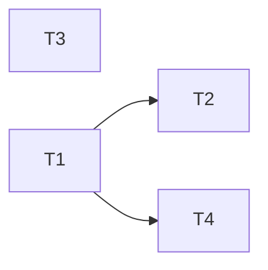

# Plan — mvp-phase4-product-defaults-ux

**Version:** 1.2  
**Status:** Complete  
**Owner:** Ale  
**Implementation SHA (closure):** `e86c6072f4fa05aab8ffa8dae3a8e3442b78644e`  
**Decision log path (T1):** `.dev/decision-logs/T1-g8-placeholder-default.md`  
**Audit:** `.dev/audits/2026-05-30-mvp-phase4-product-defaults-ux.md` — initial `fail` (2026-05-30); remediated by T3-amend + T5-amend + this §8 closure

---

## §0 Context map intake

**Path consumed:** `.dev/plans/mvp-phase4-product-defaults-ux/context-map.md`  
*(Promoted from `.dev/plans/_pending/mvp-phase4-product-defaults-ux/context-map.md` — `_pending/` path is retired.)*

**Readiness verdict:** CONDITIONAL

**Readiness rationale:** G8 is an unresolved product decision (flip default vs document-only); wet-run log LLM field ownership overlaps Phase 1 until partitioned.

**Scope-area ambiguity flags consumed:**
- Flag 1 — G8 product decision (flip code default vs document-only)
- Flag 2 — "MVP branch" vocabulary (dev vs release)
- Flag 3 — Where to record qwen LLM_MODEL/LLM_BASE_URL
- Flag 4 — What should `aria query --json` smoke assert?
- Flag 5 — Which qwen LiteLLM model ID and base URL?

**Skill version + commit SHA:** pre-plan-exploration v0.2 · ee87002297a495389b9bc79a510966dd30ab23f7

**Staleness check:** Map was generated against `ee87002`; plan is being authored at HEAD on branch `dev`. Working tree was dirty at exploration time (`?? .dev/plans/`). In-scope source files were clean — map is valid.

**Binding artifacts:** This plan file (tracked at path above). Context map at tracked path. No external out-of-tree documents are binding.

**G8 resolution adopted by this plan (Flag 1 + Flag 2):** Flip the code default in `api/config.py` from `"true"` to `"false"`. Changes land on the current `dev` branch. Rationale: Phase 4's explicit goal is operator UX improvement; defaulting to live mode makes backend-missing failures explicit rather than silently returning synthetic data. Nightly CI already sets `ARIA_PLACEHOLDER_API=false` explicitly and is unaffected. Most unit tests pass `use_placeholder` directly on service calls; **one ASGI-mounted unit test file** (`tests/unit/test_metrics.py`) reads the env default via `TestClient` — T1 (amended) sets `ARIA_PLACEHOLDER_API=true` on that file's `client` fixture. The E2E test docstring is updated as part of T1. If the user's intent was to defer the flip to a separate release branch, T1's kill criterion fires.

**§0 correction (post–T1 HALT):** The v1.0 claim that "unit tests do not read this env var" was wrong for `tests/unit/test_metrics.py::TestRetrievalMetrics::test_placeholder_query_does_not_increment`. v1.1 amends T1 scope accordingly; no re-plan.

---

## §1 Task statement

Phase 4 resolves the long-standing G8 placeholder-default UX gap (open since the architecture folder was drafted) and improves the operator getting-started experience. Concretely: (1) the code default for `ARIA_PLACEHOLDER_API` is flipped from `true` to `false` so operators who skip the README cannot accidentally believe the system works without backends; (2) the README Quickstart gains an explicit "live mode" block showing `ARIA_PLACEHOLDER_API=false` with the full stack; (3) the wet run log template in `.dev/MVP_PICKUP.md` gains explicit `LLM_MODEL=` and `LLM_BASE_URL=` fields so Phase 1 session data capture is unambiguous; and (4) a `aria query --json` CLI smoke test is added to the unit suite to provide contract coverage for the `--json` code path that currently has zero tests.

**Non-goals:**
- Phase 1–3 and Phase 5–6 MVP_PICKUP items — explicitly out of scope.
- Prometheus / telemetry gaps (G5, G6) — Phase 3.
- Architecture folder commit/approval (G10) — Phase 5.
- Wiring orchestration/MCP into production entry points — Phase 6.
- Full replacement of any eval, nightly, or integration test suite.
- Changing `aria impact --json` behaviour (only `query --json` is in scope).

---

## §2 Shared contracts

### Types / interfaces

| Symbol | Owning subtask | Typed surface | Contract | Test |
|--------|---------------|---------------|----------|------|
| `placeholder_api_enabled() -> bool` | T1 | `api/config.py:8–10` | Default env string changes from `"true"` to `"false"`; signature unchanged; truthy set stays `{"1","true","yes"}` | T1 kill criterion: `pytest tests/unit -q` after flip + fixture fix; zero new failures |
| ASGI unit `client` fixture env | T1 | `tests/unit/test_metrics.py` `client` fixture | `monkeypatch.setenv("ARIA_PLACEHOLDER_API", "true")` before `TestClient(app)` so metrics HTTP tests do not depend on live backends or the flipped default | Same run as above; `test_placeholder_query_does_not_increment` must pass |
| `_success_payload(outcome: ComplianceQuerySuccess) -> dict` | — (pre-existing, T4 consumes) | `aria/cli/commands/query.py:47–54` | Keys: `answer: str`, `sources: list`, `retrieval_strategy: str`, `trace: dict`, `aria_mode: Literal["placeholder","live"]` — frozen; T4 may not assert keys outside this set | T4 `test_query_json_placeholder_returns_valid_payload` |

### Error envelope

N/A — no new API routes or error codes introduced.

### Naming

| Symbol | Subtask | Location |
|--------|---------|----------|
| `test_query_json_placeholder_returns_valid_payload` | T4 | `tests/unit/test_cli_entry.py` |
| `T1-g8-placeholder-default.md` | T1 | `.dev/decision-logs/T1-g8-placeholder-default.md` |

### Logging

N/A — no new structured log fields or sinks.

### Tests

- Framework: pytest with `typer.testing.CliRunner` (T4); pytest + `starlette.testclient.TestClient` (T1 amended)
- Location: `tests/unit/test_cli_entry.py` (T4); `tests/unit/test_metrics.py` (T1 amended — `client` fixture only)
- Isolation:
  - **T1 (amended):** `tests/unit/test_metrics.py` `client` fixture must set `ARIA_PLACEHOLDER_API=true` via `monkeypatch` before importing/instantiating `api.main:app` (same pattern as `tests/test_telemetry_endpoints.py`). Fixture-wide, not per-test — keeps all metrics HTTP unit tests backend-independent.
  - **T4:** `runner.invoke(..., env={"ARIA_PLACEHOLDER_API": "true"})` so CLI smoke forces placeholder regardless of G8 default
- Naming prefix: `test_query_json_*` (T4)
- Coverage expectation (T4): exit code 0, stdout parses as JSON, all five `_success_payload` keys present, `aria_mode == "placeholder"`
- *Deferred (documented in CHANGELOG):* no dedicated unit test that `placeholder_api_enabled()` returns `False` when env unset — not required for T1 DoD

### CLI surface

| Flag / arg | Frozen definition | Consuming subtask |
|------------|------------------|------------------|
| `aria query <question>` positional | `aria/cli/commands/query.py:107` — `question: Annotated[str, typer.Argument(...)]` | T4 |
| `aria query --json` | `aria/cli/commands/query.py:127–130` — `as_json: Annotated[bool, typer.Option("--json", ...)]` | T4 |

### Decision log path (architectural subtask T1)

`.dev/decision-logs/T1-g8-placeholder-default.md` — created by T1. Treat any reference to a different path as a retired-string-sweep target.

---

## §3 Dependency DAG



**Parallel group {T1, T3}** — may start simultaneously. T3 does not touch any file in T1's scope.

**Sequential after T1:** T2 and T4 both require T1's G8 decision to be landed before execution.

**Soft dependency note:** T3 edits `.dev/MVP_PICKUP.md` (wet run template section). Phase 1 plan also fills the wet run log at runtime. T3 must complete before any Phase 1 wet run session fills `## Wet run log`. No DAG edge needed within this plan; noted as an inter-plan sequencing constraint.

---

## §4 Subtask specs

### T1 — G8 flip: code default + config + narrative

| Field | Content |
|-------|---------|
| **ID** | T1 |
| **Scope** | Flip `placeholder_api_enabled()` default from `"true"` to `"false"`. Update every surface that documents or relies on the old default. Write the G8 decision log. |
| **Files to touch** | `api/config.py` (line 10 default string), `.env.example` (line 44 comment), `api/main.py` (lines 103–105 OpenAPI description), `tests/eval/e2e/test_live_queries.py` (line 8 docstring), `tests/unit/test_metrics.py` (`client` fixture: `monkeypatch.setenv("ARIA_PLACEHOLDER_API", "true")` — see §2 Tests), `.dev/MVP_PICKUP.md` (G8 row line 199 and open decisions line 131), `.dev/architecture/aria/open-questions.md` (Q3 placeholder-default entry → move to Resolved section), `.dev/decision-logs/T1-g8-placeholder-default.md` (create) |
| **Contract bindings** | `placeholder_api_enabled()` typed surface (§2 Types); Decision log path (§2 Decision log path) |
| **Inputs** | None |
| **Outputs** | Updated `api/config.py`; updated `.env.example`; updated `api/main.py`; updated `test_live_queries.py` docstring; checked-off G8 in MVP_PICKUP.md; Q3 closed in open-questions.md; `.dev/decision-logs/T1-g8-placeholder-default.md` created; `pytest tests/unit -q` green |
| **Kill criteria** | (1) Halt if `pytest tests/unit -q` still has **any failures** after the default flip **and** the `test_metrics.py` fixture fix — report failing test names and exit. (On first run after flip only, a single failure in `test_placeholder_query_does_not_increment` is expected; apply the fixture fix, then re-run.) (2) Halt if the current git branch is not `dev` and no explicit user confirmation exists that the flip is intended for the actual target branch (Flag 2). (3) Halt if `.dev/decision-logs/` cannot be created (e.g., `.gitignore` blocks it) — report and await instruction. (4) Halt if fixing kill (1) requires edits outside **Files to touch** — report and escalate (no silent scope creep). |
| **Log tier** | `architectural` |
| **Risks & mitigations** | *Risk:* A test outside `tests/unit/` imports the ASGI app and reads the default env without override — kill criterion (1) is scoped to `tests/unit/`; broader failures are reported, not fixed by T1. *Landed HALT (v1.1):* `tests/unit/test_metrics.py` `client` fixture — now in scope. *Risk:* `.dev/decision-logs/` directory does not exist — T1 creates it; if `.gitignore` excludes `*.md` under `.dev/`, T1 halts. *Risk:* `api/main.py` OpenAPI description wording drifts from actual code behavior — T1 re-reads lines 100–110 before editing to ensure the updated description matches the flipped default exactly. |

---

### T2 — README live-mode Quickstart block

| Field | Content |
|-------|---------|
| **ID** | T2 |
| **Scope** | Add an explicit "Live mode" callout to the README Quickstart (lines 50–77) showing the full stack launch sequence with `ARIA_PLACEHOLDER_API=false`. Optionally cross-link from `§ HTTP Surface — Modes` (line 118). |
| **Files to touch** | `README.md` |
| **Contract bindings** | All §2 contracts (CLI surface frozen; no new symbols introduced) |
| **Inputs** | T1 (G8 flip must be landed; README must reflect the new default=false so operators understand the live-mode block is now the baseline, not an override) |
| **Outputs** | Updated `README.md` Quickstart section with a fenced bash block for live mode, including `export ARIA_PLACEHOLDER_API=false` (or a `.env` directive), and a cross-reference note in `§ HTTP Surface — Modes` |
| **Kill criteria** | (1) Halt if T1 has not completed (no confirmed flip in `api/config.py`). (2) Halt if the live-mode block's env var spelling differs from the string `ARIA_PLACEHOLDER_API` as it appears in `api/config.py`. (3) Halt if you cannot determine from T1's output whether the flip landed on `dev` — do not write "new default is false" in the README if T1 chose document-only. |
| **Log tier** | `standard` |
| **Risks & mitigations** | *Risk:* README Quickstart section has grown or shifted line numbers since the context map — T2 re-reads `README.md` lines 50–80 before editing. *Risk:* Live-mode block may make the placeholder/demo path invisible — add a note within the block that `ARIA_PLACEHOLDER_API=true` restores placeholder mode for demoing without backends. |

---

### T3 — Wet run log template + QUICK_TODOS consolidation

| Field | Content |
|-------|---------|
| **ID** | T3 |
| **Scope** | Add explicit `LLM_MODEL=` and `LLM_BASE_URL=` fields to the wet run log template in `.dev/MVP_PICKUP.md`. Consolidate the vague `.dev/QUICK_TODOS` qwen note into the template or clear it. |
| **Files to touch** | `.dev/MVP_PICKUP.md` (wet run log template lines 251–268), `.dev/QUICK_TODOS` |
| **Contract bindings** | All §2 contracts (no code symbols touched; standard naming convention for env vars). Partition constraint: T3 edits **only** the wet run log template block (lines 249–268); it does not touch the Phase 4 checklist rows (lines 197–202) or the G8 open-decisions row (line 131) — those are T1's domain. |
| **Inputs** | None (independent of T1) |
| **Outputs** | `.dev/MVP_PICKUP.md` wet run template with explicit `LLM_MODEL=` and `LLM_BASE_URL=` fields; `.dev/QUICK_TODOS` updated (cleared or annotated as consolidated) |
| **Kill criteria** | **Superseded for execution by T3-amend packet (v1.2).** Original v1.0–1.1 criteria fired KC(2) when T6 session data occupied lines 251–316. |
| **Log tier** | `standard` |
| **Risks & mitigations** | *Risk:* Flag 5 (qwen model ID unknown) forces a halt — fallback: add the qwen field as a comment with a `# TODO: confirm model string` note rather than leaving the template broken, but only after attempting to resolve from `aria/llm/client.py` defaults and `.env.example`. *Risk:* T3 and Phase 1 executor edit the same MVP_PICKUP.md section concurrently — sequencing note in §3 DAG should prevent this; executor must read the file before touching it and halt if the template section is already filled with session data. |

---

### T4 — `aria query --json` CLI smoke test

| Field | Content |
|-------|---------|
| **ID** | T4 |
| **Scope** | Add `test_query_json_placeholder_returns_valid_payload` to `tests/unit/test_cli_entry.py`. The test invokes `aria query "test question" --json` with `ARIA_PLACEHOLDER_API=true` forced via CliRunner env, and asserts exit code 0 + all five `_success_payload` keys present in parsed JSON with `aria_mode == "placeholder"`. |
| **Files to touch** | `tests/unit/test_cli_entry.py` |
| **Contract bindings** | §2 Types (`_success_payload` key set); §2 CLI surface (`aria query --json`); §2 Tests (env isolation via `env={"ARIA_PLACEHOLDER_API": "true"}`) |
| **Inputs** | T1 (code default flipped; T4 must force placeholder mode explicitly via env parameter — this only matters post-flip, but T4 should not land before T1 to avoid a window where the test passes vacuously on the old default) |
| **Outputs** | Updated `tests/unit/test_cli_entry.py` with one new test; `pytest tests/unit -q` remains green |
| **Kill criteria** | (1) Halt if `runner.invoke(app, ["query", "test question", "--json"], env={"ARIA_PLACEHOLDER_API": "true"})` raises an import error or connect error — report the exception and await investigation. (2) Halt if the JSON output from the placeholder path does not contain all five expected keys from `_success_payload`; do not weaken the assertion to pass. (3) Halt if T1 has not landed (avoid testing against the pre-flip default). (4) Halt if adding this test causes any pre-existing `test_cli_entry.py` test to fail. |
| **Log tier** | `standard` |
| **Risks & mitigations** | *Risk:* `CliRunner.invoke env=` may not propagate to `os.environ` if `load_dotenv()` in `aria/cli/main.py` overrides it — Click's CliRunner patches `os.environ` during invocation before `load_dotenv()` runs, so env= wins; if this assumption fails, kill criterion (1) fires. *Risk:* `AppConnections()` initialised without args may raise if it has side effects in the constructor — pre-existing help tests use the same import path without triggering this; kill criterion (1) catches any regression. |

---

## §5 Adversarial pass

*(Answered under the packet-only executor persona: "If I received only this subtask's packet plus executor SKILL.md, I would…")*

### §5.1 Rejected decompositions

**Rejected: merged T1 + T2 into a single "G8 + docs" subtask.**  
Reason: T2 is straightforward doc markup that depends on T1's *output* (confirmed flip) but adds no implementation complexity. Merging bloats the architectural subtask with content-editing work and precludes parallel execution of T3. The packet-only executor for a merged T1+T2 would face scope confusion: half the work is product-decision + multi-file code change, the other half is README prose.

**Rejected: marking T4 as out-of-scope / optional.**  
Reason: after the G8 flip, `--json` in placeholder mode is the only unit-level path exercised without backends. Shipping the flip without any contract test for `--json` leaves an unguarded regression surface. The context map's Flag 4 ("what should the smoke assert?") is fully resolved by `_success_payload`'s documented key set — there is no remaining ambiguity that justifies deferral.

### §5.2 Load-bearing assumptions

*(Format: `claim | contract surface | failure mode | subtask IDs`)*

1. `All existing unit tests pass after flip plus ASGI fixture isolation | api/config.py:10 ↔ tests/unit/test_metrics.py client fixture ↔ §2 Tests (T1) | if additional unit tests mount api.main without env override, kill (1) fires after fixture fix; escalate via kill (4) | T1` — **partially falsified at HALT; closed by v1.1 scope amendment** (fixture fix in `test_metrics.py`)

2. `CliRunner.invoke env= parameter propagates to os.environ for os.getenv calls within the invoked CLI app | §2 Tests row (env isolation) ↔ aria/cli/commands/query.py:71 ↔ api/config.py:10 | if env= does not propagate, T4 smoke cannot isolate placeholder mode post-flip and kill criterion (1) fires | T4`

3. `.dev/decision-logs/ directory can be created by T1 executor | §2 Decision log path `.dev/decision-logs/T1-g8-placeholder-default.md` | if directory is .gitignored or blocked, decision log cannot land and T1 kill criterion (3) fires | T1`

4. `Qwen model string is resolvable to a valid LiteLLM model ID before T3 execution | .dev/QUICK_TODOS ↔ .dev/MVP_PICKUP.md wet run template | if the model string cannot be confirmed, T3 kill criterion (1) fires; wet run template gets a placeholder comment rather than a broken model string | T3`

5. `T3 executes before any Phase 1 wet run session fills the MVP_PICKUP.md § Wet run log section | .dev/MVP_PICKUP.md:249-268 ↔ §3 DAG inter-plan sequencing note | **falsified 2026-05-30** — T6 session filled block first; T3 HALT; closed by T3-amend append-only path (§7) | T3`

### §5.3 Highest re-plan risk

**T1** — the G8 flip is the plan's sole architectural action. **HALT fired (2026-05-30):** `test_placeholder_query_does_not_increment`; resolved by v1.1 **option (a)** — amend T1 to include `tests/unit/test_metrics.py` fixture isolation. Re-plan not warranted: no other `tests/unit` file shares this pattern (service-layer tests use `use_placeholder=`; only `test_metrics.py` has a local `TestClient` fixture).

Secondary process risk: `.dev/decision-logs/` directory is new (no precedent). If the user's project convention places decision logs elsewhere, path drift is a contract violation — catch it by running `git ls-files .dev/` before writing.

### §5.4 Hidden couplings

*(Format: `claim | contract surface | failure mode | subtask IDs` · confirmed / suspected)*

1. `placeholder_api_enabled default flip affects any test that instantiates the ASGI app without env override | api/config.py:10 ↔ tests/eval/e2e/test_live_queries.py (ASGITransport) | after flip, running test_live_queries.py without ARIA_PLACEHOLDER_API=true attempts live backend connections and gets 503 | T1` — **confirmed** (the file explicitly documents the old default in its docstring)

2. `T3 and Phase 1 co-edit MVP_PICKUP.md § Wet run log section | .dev/MVP_PICKUP.md:249-268 ↔ Phase 1 execution artifact | concurrent execution = merge conflict in the same template block | T3` — **confirmed** (context map Surface 5)

3. `api/main.py OpenAPI description hard-codes "ARIA_PLACEHOLDER_API=true (default)" | api/main.py:103 ↔ api/config.py:10 | after flip, OpenAPI docs disagree with code behavior until T1 updates the string | T1` — **confirmed** (grep verified lines 103–105)

4. `.env.example comment line 44 references old "true" default (commented out) | .env.example:44 ↔ api/config.py:10 | operator copies .env.example and gets no explicit value; comments describe the old behavior | T1` — **confirmed** (file read confirmed)

5. `tests/unit/test_metrics.py client fixture mounts api.main without ARIA_PLACEHOLDER_API override | tests/unit/test_metrics.py:505-512 ↔ api/config.py:10 ↔ TestRetrievalMetrics | post-flip, /query runs live retrieval and RETRIEVAL_COUNTER increments; test_placeholder_query_does_not_increment fails | T1` — **confirmed** (HALT evidence: 121 passed, 1 failed)

6. `T2 README live-mode block must match the G8 decision outcome | §2 Types row 1 ↔ README.md Quickstart | if T1 chose document-only (not flip) and T2 writes "default is now false", README is false | T2` — **suspected** (resolved by T2 kill criterion (3): read T1 output before writing)

---

## §6 Executor packets

Packets saved at:
- `.dev/plans/mvp-phase4-product-defaults-ux/packets/T1.md`
- `.dev/plans/mvp-phase4-product-defaults-ux/packets/T2.md`
- `.dev/plans/mvp-phase4-product-defaults-ux/packets/T3.md` *(superseded — post-mortem)*
- `.dev/plans/mvp-phase4-product-defaults-ux/packets/T3-amend.md` **← execute for wet-run template**
- `.dev/plans/mvp-phase4-product-defaults-ux/packets/T4.md`
- `.dev/plans/mvp-phase4-product-defaults-ux/packets/T5-amend.md` **← audit remediation**

Each packet is self-contained. An executor receiving only the packet (plus executor SKILL.md) has sufficient context without consulting this plan file.

**Retired-string sweep (v1.1):** Re-emitted `packets/T1.md` after scope amendment. T2–T4 unchanged (they already assume post-flip default and explicit placeholder env for T4). Retired: v1.0 T1 kill criterion "do not fix tests outside Files to touch" without scope change — superseded by amended Files to touch list.

---

## §7 Amendment subtasks

### T1-amend — HALT remediation: ASGI unit test placeholder isolation

**Trigger:** T1 executor HALT on kill criterion (1) — `tests/unit/test_metrics.py::TestRetrievalMetrics::test_placeholder_query_does_not_increment` failed after default flip (live `/query` incremented `RETRIEVAL_COUNTER`).

**Decision:** Expand T1 **Files to touch** (not a separate T1.1 node). Rationale: plan §5.3 already authorized option (a); single file, single fixture; no parallel conflict with T2–T4.

**DAG:** No new edges. T2 and T4 remain blocked until T1 completes (including fixture fix).

**Scope:** Add `monkeypatch.setenv("ARIA_PLACEHOLDER_API", "true")` to the `client` fixture in `tests/unit/test_metrics.py` (accept `monkeypatch: pytest.MonkeyPatch` on the fixture). Re-run `pytest tests/unit -q`.

**DoD:** Kill criteria (1)–(3) satisfied; decision log **Assumptions** section notes the corrected unit-test / ASGI coupling (supersede v1.0 "unit tests do not read env" prose if present).

**Partial work on disk (do not revert):** Implementation/docs from pre-HALT T1 may already exist — executor verifies each file, applies only missing edits, then lands fixture fix and re-runs tests.

**Packet:** `packets/T1.md` re-emitted at plan v1.1 (self-contained; supersedes v1.0 T1 packet for execution).

### T3-amend — HALT remediation: append wet-run template (do not overwrite T6 session)

**Trigger:** T3 executor HALT on kill criterion **(2)** — `## Wet run log` contains completed T6 golden-path session (2026-05-30), not the blank scaffold.

**Orchestrator decision:** **Option 2** — append a copy-paste template subsection; preserve session history. **Not** option 1 (close without template — fails audit F-01/F-02). **Not** option 3 (archive/replace — requires explicit user approval for data movement).

**DAG:** No new edges. T3-amend may run in parallel with **T5-amend**.

**Scope:**
1. `.dev/MVP_PICKUP.md` — **Do not edit** the filled session inside the existing fenced block (approx. lines 251–316). Optionally retitle `## Wet run log (fill on first live session)` → `## Wet run log` with a one-line note that the first session is recorded below.
2. **After** the closing ` ``` ` of the session block, add `## Wet run log template (copy for next session)` with a **new** fenced `text` block containing blank `LLM_MODEL=` / `LLM_BASE_URL=` lines (see T3-amend packet for binding example values from `.env.example`).
3. `.dev/QUICK_TODOS` — replace scratch line with pointer to the new template section (consolidation).

**Kill criteria (T3-amend):**
1. Halt if template would use `LLM_MODEL=qwen something` or any non–LiteLLM-safe placeholder without `.env.example` / `aria/llm/client.py` / comment fallback per original KC(1).
2. Halt if edits touch **inside** the T6 session fenced block (data loss risk) — report and escalate.
3. Halt if the new template subsection is missing both `LLM_MODEL=` and `LLM_BASE_URL=` as dedicated lines.

**DoD:** F-01 closed; §1 item (3) satisfied for **future** sessions; QUICK_TODOS consolidated.

**Packet:** `packets/T3-amend.md` (supersedes `packets/T3.md` for execution).

### T5-amend — Audit remediation: CHANGELOG + MVP_PICKUP checkboxes + plan metadata

**Trigger:** Adversarial audit `.dev/audits/2026-05-30-mvp-phase4-product-defaults-ux.md` — F-03 (T4 changelog line lost at `08c12ab`), F-06 (Phase 4 checkboxes stale), F-04 (plan status / §8 gate).

**DAG:** `T5-amend` may run in parallel with `T3-amend`. **Orchestrator** (not executor) fills §8 after both land and verification passes.

**Scope:**
1. `CHANGELOG.md` — under `mvp-phase4-product-defaults-ux`, restore **T4** bullet (re-read `git show e06417b:CHANGELOG.md` for wording; do not drop on future doc-only commits).
2. `.dev/MVP_PICKUP.md` — Phase 4 checklist (lines ~197–202 only): mark `[x]` for README live-mode, QUICK_TODOS/LLM template (after T3-amend), `aria query --json` smoke when T4 is at HEAD.
3. Do **not** edit plan §8 (orchestrator-owned).

**Kill criteria:**
1. Halt if T4 commit is not on current branch (`tests/unit/test_cli_entry.py` contains `test_query_json_placeholder_returns_valid_payload`).
2. Halt if CHANGELOG phase-4 section still lacks T4 after edit.

**Packet:** `packets/T5-amend.md`

**Retired-string sweep:** T3 packet references `ollama/llama3.2` as `.env.example` default — **retired**; binding default is `gpt-4o-mini` / `https://api.openai.com/v1` per HEAD `.env.example` lines 15–16.

---

## §8 Auditor handoff

### §8.1 Completion snapshot

| Field | Value |
|-------|--------|
| **Tree SHA** | `e86c6072f4fa05aab8ffa8dae3a8e3442b78644e` |
| **Branch** | `dev` |
| **Verification command** | `pytest tests/unit -q` |
| **Environment** | Windows 10, Python 3.14.2 (local run 2026-05-30) |
| **Result** | **123 passed**, 0 failed, exit code **0**, 38 warnings (chromadb `asyncio.iscoroutinefunction` deprecation) |

**Note:** Code and docs through T5-amend are at `e86c607`. This plan file’s **Complete** status and full §8 block were written on the working tree immediately after that SHA; commit `plan.md`, `packets/T3-amend.md`, `packets/T5-amend.md`, and the phase-4 audit file together so `git show HEAD:` matches §8.2 for auditors.

**Commits (phase 4, oldest → newest):** `b3725f4` T1 · `7e7a384` plan v1.1 · `e06417b` T4 · `08c12ab` T2 · `37b181f` T3-amend · `e86c607` T5-amend

### §8.2 Artifact chain

Read in order. Paths must resolve at closure SHA unless noted.

| # | Path | Status at `e86c607` |
|---|------|------------------------|
| 1 | `.dev/plans/mvp-phase4-product-defaults-ux/context-map.md` | present-in-HEAD (scout SHA `ee87002` — **stale**; see §8.4 P-01) |
| 2 | `.dev/plans/mvp-phase4-product-defaults-ux/plan.md` | present-in-HEAD (v1.2 gate); **§8 Complete** on working tree — commit with row 8–9 |
| 3 | `.dev/plans/mvp-phase4-product-defaults-ux/packets/T1.md` | present-in-HEAD |
| 4 | `.dev/plans/mvp-phase4-product-defaults-ux/packets/T2.md` | present-in-HEAD |
| 5 | `.dev/plans/mvp-phase4-product-defaults-ux/packets/T3.md` | present-in-HEAD (superseded — post-mortem) |
| 6 | `.dev/plans/mvp-phase4-product-defaults-ux/packets/T4.md` | present-in-HEAD |
| 7 | `.dev/decision-logs/T1-g8-placeholder-default.md` | present-in-HEAD |
| 8 | `.dev/plans/mvp-phase4-product-defaults-ux/packets/T3-amend.md` | **commit with closure** (orchestrator packet; not in `e86c607`) |
| 9 | `.dev/plans/mvp-phase4-product-defaults-ux/packets/T5-amend.md` | **commit with closure** |
| 10 | `.dev/audits/2026-05-30-mvp-phase4-product-defaults-ux.md` | **commit with closure** |

### §8.3 §2 evidence

| §2 row | Landed artifact | Proof |
|--------|-----------------|-------|
| `placeholder_api_enabled()` default `"false"` | `api/config.py:10` | `pytest tests/unit -q` green; T1 decision log |
| ASGI `client` fixture env | `tests/unit/test_metrics.py:506-507` | `test_placeholder_query_does_not_increment` in suite (123 passed) |
| `_success_payload` keys + CLI | `aria/cli/commands/query.py:47-54` | `tests/unit/test_cli_entry.py:24-38` `test_query_json_placeholder_returns_valid_payload` |
| CLI `aria query` / `--json` | `aria/cli/commands/query.py:107`, `127-130` | Same test invokes `["query", "test question", "--json"]` |
| Tests policy (unit, CliRunner env) | `tests/unit/test_cli_entry.py`, `tests/unit/test_metrics.py` | §8.1 command |
| Wet-run template `LLM_MODEL` / `LLM_BASE_URL` | `.dev/MVP_PICKUP.md:320-329` (`## Wet run log template`) | Grep + T3-amend CHANGELOG; docs-only (no pytest) |
| Decision log path | `.dev/decision-logs/T1-g8-placeholder-default.md` | `git show e86c607:.dev/decision-logs/T1-g8-placeholder-default.md` |
| Error envelope / Logging | N/A | — |

**Landed (T2/T3-amend/T5-amend, docs):** `README.md` Live mode block · `.dev/QUICK_TODOS` pointer · `CHANGELOG.md` phase-4 section (T1–T5-amend bullets) · `.dev/MVP_PICKUP.md` Phase 4 checklist lines 199–202 `[x]`

**Deferred (§2 acknowledged):** no unit test that `placeholder_api_enabled()` is `False` when `ARIA_PLACEHOLDER_API` unset — documented in CHANGELOG T1/T4 gaps.

### §8.4 §5 disposition

| Item | Status | Notes |
|------|--------|-------|
| §5.2 #1 unit tests + ASGI fixture after flip | **closed** | T1-amend fixture `b3725f4`; 123 passed at §8.1 |
| §5.2 #2 CliRunner `env=` propagation | **closed** | T4 test at `e06417b` |
| §5.2 #3 `.dev/decision-logs/` creatable | **closed** | T1 decision log in HEAD |
| §5.2 #4 qwen model resolvable | **closed** | T3-amend uses `.env.example` `gpt-4o-mini` + Ollama comment, not `qwen something` |
| §5.2 #5 T3 before Phase 1 fill | **closed** | Falsified; T3-amend append path `37b181f` |
| §5.3 T1 re-plan risk | **closed** | HALT remediated v1.1; no further unit ASGI mounts without env |
| §5.4 #1 ASGI / e2e live default | **closed** | `test_live_queries.py` docstring updated (T1) |
| §5.4 #2 T3 ∥ Phase 1 wet run | **closed** | Session preserved; template appended |
| §5.4 #3–#4 OpenAPI / `.env.example` | **closed** | T1 |
| §5.4 #5 metrics `client` fixture | **closed** | T1-amend |
| §5.4 #6 T2 vs T1 outcome | **closed** | T2 landed after T1 flip |
| Context map staleness (audit P-01) | **treat-as-prediction** | Scout `ee87002`; verify against `e86c607` code, not map alone |
| Architecture inventory default `true` (audit F-07) | **open** | Phase 5 G10; non-blocking for phase 4 |
| Audit F-01 / F-02 / F-03 / F-04 / F-06 | **closed** | T3-amend + T5-amend + §8 fill |

### §8.5 Cold-read seeds

1. `api/config.py` (`placeholder_api_enabled`)
2. `tests/unit/test_metrics.py` (`client` fixture, `TestRetrievalMetrics`)
3. `tests/unit/test_cli_entry.py` (`test_query_json_placeholder_returns_valid_payload`)
4. `.dev/MVP_PICKUP.md` (Phase 4 checklist + wet-run template subsection)
5. `CHANGELOG.md` (`mvp-phase4-product-defaults-ux` section)
6. `.dev/decision-logs/T1-g8-placeholder-default.md`

### §8.6 Audit remediation cross-link

| Audit finding | Remediation | Evidence |
|---------------|-------------|----------|
| F-01 / F-02 T3 template | T3-amend `37b181f` | `.dev/MVP_PICKUP.md` `## Wet run log template` |
| F-03 T4 CHANGELOG lost | T5-amend `e86c607` | `CHANGELOG.md` T4 bullet restored |
| F-04 §8 / plan closure | Orchestrator §8 (this block) | Plan **Complete** |
| F-06 MVP_PICKUP checkboxes | T5-amend | Lines 199–202 `[x]` |
| F-05 unset-env unit test | **open** (deferred per §2) | CHANGELOG T1 gap |
| F-07 architecture inventory | **open** (Phase 5) | Non-blocking |

**Re-audit:** After committing row 8–10 in §8.2, re-run adversarial audit against `e86c607` + closure commit; expect `pass` on F-01–F-04, F-06 with F-05/F-07 still minor/open.
