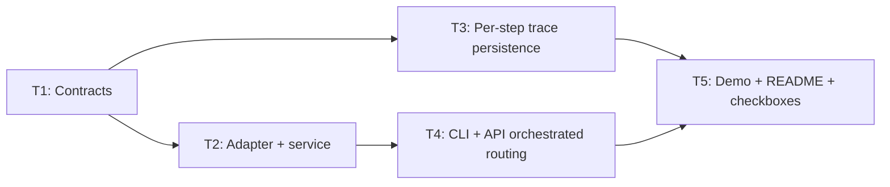

# Plan — mvp-phase6-mvp-plus

**Version:** 1.1
**Status:** Active — §8 handoff invalid (T2 uncommitted at closure SHA; see §8.1)
**Orchestrator skill:** orchestrator-planning v0.6
**Plan file:** `.dev/plans/mvp-phase6-mvp-plus/plan.md`
**Decision log path (T2):** `.dev/decision-logs/T2-mcp-adapter-wiring.md`

---

## §0 Context map intake

**Path consumed:** `.dev/plans/mvp-phase6-mvp-plus/context-map.md`
*(Promoted from `.dev/plans/_pending/mvp-phase6-mvp-plus/context-map.md` per path-discipline rule. All `_pending/` references in plan or packets are retired strings.)*

**Readiness verdict:** CONDITIONAL

**Readiness rationale:** Core types and adapters exist, but orchestrated query semantics vs `run_compliance_query`, per-step telemetry shape, and demo artifact location needed decisions before executor specs could be sound.

**Scope-area ambiguity flags — orchestrator decisions (binding for all executors):**

| Flag | Category | Decision |
|------|----------|----------|
| Flag 1 | vocabulary_collision | `--orchestrated` routes through the existing scratch graph's `free_query_node` (vector_search only). Answers differ from `run_compliance_query` (GraphRAG hybrid). Documented in CLI help and README. No graph redesign. Accepts Surface 7 as a non-issue: demo value is "visible agent routing and trace", not answer parity. |
| Flag 2 | ownership | Factory `build_mcp_adapter(conns: AppConnections) -> MCPToolPortsAdapter` lives in new `aria/services/orchestrated_query.py`. Both CLI and API import from there — no duplication. |
| Flag 3 | coexisting_model_versions | Per-step rows in `agent_executions` using `agent_name = f"{ORCHESTRATION_SCRATCH_AGENT_NAME}/{node_name}"` (slash separator). No new SQLite table or schema change. Aggregate `orchestration.scratch` row kept unchanged. |
| Flag 4 | missing_test_coverage | New `tests/unit/test_mcp_adapter.py` with stub `MCPServer` (returns known `ToolResult`). Owned by T2. |
| Flag 5 | ownership | `orchestrated: bool = False` as Pydantic body field on `ComplianceQueryRequest`. No query param, no separate route. Backward compatible (default False). Owned by T1. |
| Flag 6 | deprecation_marker_absent | T1 kill criterion: halt if any of Phase 1–4 plans lacks `Status: Complete`. Phase 5 `Active` is non-blocking (doc hygiene only). |
| Flag 7 | ownership | Demo artifacts at `.dev/demo/aria-mvp-demo.sh` (demo script) + optional `.dev/demo/aria-mvp-demo.cast` (asciinema recording, committed only if recorded). README gets a `## Demo` section. `MVP_PICKUP.md` Phase 6 checkboxes marked `[x]`. Owned by T5. |

**Surface resolutions (binding):**
- **Surface 8** (placeholder gate): CLI → exit 1 + stderr `"Orchestrated mode requires live backends. Set ARIA_PLACEHOLDER_API=false."`; API → HTTP 400 + JSON `{"detail": "Orchestrated mode requires live backends. Set ARIA_PLACEHOLDER_API=false."}`.
- **Surface 9** (X-ARIA-Mode header): New value `"orchestrated-live"` for orchestrated + live path. Non-orchestrated paths keep existing `"live"` / `"placeholder"` values unchanged.
- **Surface 10** (`index_vectors` stub): T2 fixes `MCPToolPortsAdapter.index_vectors` to call the real VectorStore indexing method. Executor verifies the exact method name from `aria/retrieval/vector_store.py` before implementing.

**Skill version + commit SHA at map generation:** pre-plan-exploration v0.2 · `ee87002297a495389b9bc79a510966dd30ab23f7`

**Staleness check:** Map generated at `ee87002`; current HEAD is `855abcb` (Phase 5 T2 — README call graph). In-scope orchestration and MCP files (`mcp/server.py`, `orchestration/scratch/`, `api/routers/query.py`, `aria/services/compliance_query.py`) were NOT touched in Phase 3–5 commits. Phase 3 modified observability (metrics, telemetry_store, llm/client.py); Phase 4 modified `api/config.py`, `test_metrics.py`, `test_cli_entry.py`, `README.md`, `MVP_PICKUP.md`; Phase 5 modified `path_to_release.md`, `README.md`, architecture folder. Context map is valid for all `direct` in-scope surfaces. **Verdict: stale SHA but in-scope surfaces unchanged; proceed with CONDITIONAL.**

**Binding artifacts:** This plan file (tracked path above). Context map at promoted tracked path. Phase 1–4 plan files (read for prerequisite check in T1 kill criterion). No out-of-tree documents are binding.

---

## §1 Task statement

Phase 6 (MVP+) wires the MCP adapter and scratch orchestration engine into the production CLI and API query paths behind an opt-in `--orchestrated` / `orchestrated: true` flag, adds per-step execution trace persistence to the telemetry store beyond the existing aggregate row, and produces a demo shell script and optional asciicast suitable for a portfolio narrative. The four checklist items from `.dev/MVP_PICKUP.md:215–218` are fully addressed.

Concretely: (1) `MCPToolPortsAdapter` is instantiated with live Neo4j/Chroma clients via a new `build_mcp_adapter(conns)` factory in `aria/services/orchestrated_query.py`; the `index_vectors` stub is replaced with real Chroma indexing; (2) `aria query --orchestrated` and `POST /query` with `orchestrated: true` body field route through `OrchestrationGraph.execute` instead of `run_compliance_query`; the response includes `execution_trace` from `ExecutionResult.to_trace_dict()`; (3) each graph step writes an `agent_executions` row with `agent_name = "orchestration.scratch/{node_name}"`, making per-step durations queryable via `aria telemetry`; (4) a demo shell script documents the full orchestrated path for portfolio presentation.

**Non-goals:**
- Redesigning scratch graph routing or adding a GraphRAG path to `free_query_node` to match `run_compliance_query` answer quality (Flag 1 decision; semantic parity deferred).
- Making `--orchestrated` produce identical answers to the standard GraphRAG path.
- HTTP ingest via orchestrated graph — ingest demo path is out of Phase 6 CLI scope.
- LangGraph reference parity — illustrative artifact only; no parity work.
- A2A cross-process mesh — in-process registry only, unchanged.
- Phase 5 items (AUDIT_DIGEST sync, `path_to_release.md` §2–5) — owned by `phase-5-doc-architecture-hygiene` plan.
- Grafana dashboards, alert rules, GNN layer.

---

## §2 Shared contracts

### Types / interfaces

| Symbol | Owning subtask | Typed surface | Round-trip / construction test |
|--------|---------------|---------------|-------------------------------|
| `ComplianceQueryRequest.orchestrated: bool = False` | T1 | `aria/services/compliance_query.py:ComplianceQueryRequest` | T4 `test_orchestrated_cli_smoke_placeholder_blocked` (asserts exit 1 when placeholder + `--orchestrated`) |
| `ComplianceQueryResponse.execution_trace: dict[str, Any] \| None = None` | T1 | `aria/services/compliance_query.py:ComplianceQueryResponse` | T4 verifies non-None only in orchestrated success path; placeholder path remains None (§5.2 #5) |
| `build_mcp_adapter(conns: AppConnections) -> MCPToolPortsAdapter` | T2 | `aria/services/orchestrated_query.py` | T2 `test_mcp_adapter_construction` |
| `run_orchestrated_query(request_dto: ComplianceQueryRequest, conns: AppConnections) -> ComplianceQueryOutcome` | T2 | `aria/services/orchestrated_query.py` | T2 `test_run_orchestrated_query_missing_deps_returns_unavailable` |
| `ORCHESTRATION_SCRATCH_AGENT_NAME` (existing) | existing | `aria/orchestration/scratch/graph.py:29` | Existing `TestOrchestrationTelemetry` |

**Note (T1 field compat):** `ComplianceQueryRequest` has `extra="forbid"`. Adding `orchestrated: bool = False` is backward compatible — existing clients omitting the field get `False`; clients passing extra unknown fields still get 422. `_success_payload` in `query.py` includes `execution_trace` **only when not None** (conditional inclusion), so Phase 4 test `test_query_json_placeholder_returns_valid_payload` is unaffected (non-orchestrated returns `None` → key omitted).

### Error envelope

| Trigger | Shape | Binding for |
|---------|-------|-------------|
| `--orchestrated` + `ARIA_PLACEHOLDER_API=true` (CLI) | Exit 1; stderr: `"Orchestrated mode requires live backends. Set ARIA_PLACEHOLDER_API=false."` | T4 |
| `orchestrated=true` + `placeholder_api_enabled()=true` (API) | HTTP 400; body: `{"detail": "Orchestrated mode requires live backends. Set ARIA_PLACEHOLDER_API=false."}` | T4 |
| `orchestrated=true` + Neo4j or Chroma missing in live mode | `ComplianceQueryUnavailable` → CLI exit 1 / API 503 `ServiceUnavailableBody` (existing pattern from `api/errors.py`) | T2, T4 |

### Naming

| Symbol / path | Subtask |
|---------------|---------|
| `aria/services/orchestrated_query.py` | T2 (new module) |
| `tests/unit/test_mcp_adapter.py` | T2 (new test file) |
| `.dev/demo/aria-mvp-demo.sh` | T5 (new demo script) |
| `.dev/demo/aria-mvp-demo.cast` | T5 (optional; committed only if recorded) |
| `test_mcp_adapter_construction` | T2 in `test_mcp_adapter.py` |
| `test_run_orchestrated_query_missing_deps_returns_unavailable` | T2 in `test_mcp_adapter.py` |
| `test_orchestrated_cli_smoke_placeholder_blocked` | T4 in `tests/unit/test_cli_entry.py` |
| `X-ARIA-Mode: orchestrated-live` | T4 — API response header for orchestrated + live path only |
| `.dev/decision-logs/T2-mcp-adapter-wiring.md` | T2 (architectural decision log) |

### Logging

No new structlog fields. Existing `request_id` from `structlog.contextvars` binds per-step `agent_executions` rows to the HTTP request (same as the aggregate row — already in `_record_scratch_orchestration_telemetry`).

### Tests

- Framework: pytest
- **T2:** `tests/unit/test_mcp_adapter.py` — stub `MCPServer` that returns known `ToolResult(success=True, data=[])` for any `call_tool`; tests: construction, `test_run_orchestrated_query_missing_deps_returns_unavailable` (pass `AppConnections()` with both clients None).
- **T3:** extend `tests/unit/test_orchestration.py:TestOrchestrationTelemetry` — assert `record_agent_execution` called N+1 times where N = steps + 1 aggregate; assert at least one call with `agent_name` matching prefix `"orchestration.scratch/"`.
- **T4:** extend `tests/unit/test_cli_entry.py` — `test_orchestrated_cli_smoke_placeholder_blocked` (CliRunner, `env={"ARIA_PLACEHOLDER_API": "true"}`, `["query", "test question", "--orchestrated"]`, assert exit 1).
- **Trajectory eval:** `tests/eval/test_trajectory_eval.py` must not regress — T4 routing must not alter EDGE_MAP or CANONICAL path constants.
- **No pytest** for T5 demo artifacts (manual wet run).

### CLI surface

| Flag | Frozen definition | Consuming subtask |
|------|------------------|------------------|
| `aria query --orchestrated` | `aria/cli/commands/query.py` — `as_orchestrated: Annotated[bool, typer.Option("--orchestrated", help="Route query through OrchestrationGraph (vector-only; exposes agent trace). Requires live backends.")]` default `False` | T4 |
| `aria query --json` | existing (Phase 4 frozen) — JSON output adds `"execution_trace"` key when `--orchestrated` and not placeholder-blocked | T4 |

### Decision log path (architectural subtask T2)

`.dev/decision-logs/T2-mcp-adapter-wiring.md` — created by T2. Any reference to a different path in plan or packets is a retired-string-sweep target. Auditors: this path must resolve at HEAD for §8.2 to be valid.

---

## §3 Dependency DAG



**Parallel group {T2, T3}:** After T1 completes, T2 and T3 may start simultaneously. T2 touches `aria/services/orchestrated_query.py` (new), `aria/protocols/mcp/server.py`, `tests/unit/test_mcp_adapter.py` (new), and `.dev/decision-logs/T2-mcp-adapter-wiring.md`. T3 touches only `aria/orchestration/scratch/graph.py` and `tests/unit/test_orchestration.py`. Zero file overlap.

**Sequential after T2:** T4 requires the `run_orchestrated_query` import from T2's new module. T3 is NOT a hard prerequisite for T4.

**Sequential after T4 AND T3:** T5 requires both orchestrated routing (T4 complete) and per-step traces (T3 complete) so the demo script can show `aria telemetry` output with per-node rows.

**Soft dependency note:** T4 edits `tests/unit/test_cli_entry.py`, last touched by Phase 4 T4. Re-read the file before editing; ensure `test_query_json_placeholder_returns_valid_payload` remains green.

---

## §4 Subtask specs

### T1 — DTO contracts: `ComplianceQueryRequest.orchestrated` + `ComplianceQueryResponse.execution_trace`

| Field | Content |
|-------|---------|
| **ID** | T1 |
| **Scope** | Add `orchestrated: bool = False` to `ComplianceQueryRequest`; add `execution_trace: dict[str, Any] \| None = None` to `ComplianceQueryResponse`. Both fields use defaults; both are backward compatible. No routing logic in this subtask. |
| **Files to touch** | `aria/services/compliance_query.py` (both Pydantic models, lines 26–50) |
| **Contract bindings** | §2 Types (both new fields, compat note); §2 Tests (no new test in T1; T4 owns the test) |
| **Inputs** | None |
| **Outputs** | Updated `aria/services/compliance_query.py`. `pytest tests/unit -q` remains green after the edit. |
| **Kill criteria** | 1. Halt if `ComplianceQueryRequest.model_config` does not have `extra="forbid"` after the edit — must be preserved. 2. Halt if `pytest tests/unit -q` shows any new failures after adding the fields — likely cause is exact-key-equality assertion on `_success_payload`; report the failing test and await instruction before proceeding. 3. Halt if Phase 1–4 plan files do not all show `Status: Complete` at execution start (prerequisite gate for the MVP+ phase, §0 Flag 6). Report any non-Complete plan status. |
| **Log tier** | `standard` |
| **Risks & mitigations** | *Risk:* Phase 4 test `test_query_json_placeholder_returns_valid_payload` uses exact set equality on `_success_payload` keys. Adding `execution_trace` to `ComplianceQueryResponse` (with default `None`) would add it to the payload only when not None — placeholder path leaves `None`, so the key is conditionally included in `_success_payload`. Kill criterion 2 catches any regression. *Risk:* `Any` import needed for `dict[str, Any]` annotation — verify `from typing import Any` is already in the file before adding it. |

---

### T2 — Live adapter wiring: `build_mcp_adapter` + `run_orchestrated_query` + `index_vectors` fix

| Field | Content |
|-------|---------|
| **ID** | T2 |
| **Scope** | Create `aria/services/orchestrated_query.py` with `build_mcp_adapter(conns: AppConnections) -> MCPToolPortsAdapter` and `run_orchestrated_query(request_dto: ComplianceQueryRequest, conns: AppConnections) -> ComplianceQueryOutcome`. Fix `MCPToolPortsAdapter.index_vectors` stub in `aria/protocols/mcp/server.py` to call the real VectorStore indexing method (verify method name from `aria/retrieval/vector_store.py` before implementing). Add unit tests. Write decision log. |
| **Files to touch** | `aria/services/orchestrated_query.py` (new), `aria/protocols/mcp/server.py` (lines 182–183), `tests/unit/test_mcp_adapter.py` (new), `.dev/decision-logs/T2-mcp-adapter-wiring.md` (new) |
| **Contract bindings** | §2 Types (`build_mcp_adapter`, `run_orchestrated_query` signatures); §2 Error envelope (unavailable deps → `ComplianceQueryUnavailable`); §2 Naming (module path, test names, decision log path); §2 Tests (stub MCPServer pattern); §2 Decision log path |
| **Inputs** | T1 (`ComplianceQueryRequest` with `orchestrated` field; `ComplianceQueryResponse` with `execution_trace` field; `ComplianceQueryOutcome` union type — all in `aria/services/compliance_query.py`) |
| **Outputs** | `aria/services/orchestrated_query.py`; patched `aria/protocols/mcp/server.py`; `tests/unit/test_mcp_adapter.py` with at minimum `test_mcp_adapter_construction` and `test_run_orchestrated_query_missing_deps_returns_unavailable`; `.dev/decision-logs/T2-mcp-adapter-wiring.md`; `pytest tests/unit -q` green. |
| **Kill criteria** | 1. Halt if `ToolPorts` protocol methods in `aria/orchestration/scratch/nodes.py` are NOT all `async` — sync/async mismatch with `MCPToolPortsAdapter` requires a graph redesign that is out of Phase 6 scope; report and escalate. 2. Halt if `aria/retrieval/vector_store.py` has no method suitable for replacing the `index_vectors` stub (e.g. no `upsert_chunks`, `add`, or `index` equivalent) — report the actual VectorStore public API and await instruction; do not implement a silent no-op. 3. Halt if importing `build_default_graph` from `aria/orchestration/scratch/graph.py` in `aria/services/orchestrated_query.py` causes a circular import that breaks `pytest tests/unit -q` — use a lazy import inside the function body and document in the decision log; if the lazy import still breaks mypy strict, report and await. 4. Halt if `pytest tests/unit -q` has new failures after this subtask — report all failing tests. |
| **Log tier** | `architectural` |
| **Risks & mitigations** | *Risk (Surface 1/confirmed):* ToolPorts/MCPToolPortsAdapter method signature drift (return types, extra params beyond what the protocol declares). Mitigation: executor reads both `nodes.py:ToolPorts` and `server.py:MCPToolPortsAdapter` side-by-side before implementing; kill criterion 1 fires on async mismatch. *Risk (Surface 10/confirmed):* `index_vectors` stub returns `True` without Chroma write — fix requires knowing VectorStore's actual indexing API. Mitigation: kill criterion 2 + decision log records the actual method name. *Risk:* `build_default_graph` lazy import may still fail type-checking. Mitigation: if mypy fails, inline graph construction in `run_orchestrated_query` without importing `build_default_graph` (acceptable for MVP demo scope); decision log notes the choice. *Risk:* `run_orchestrated_query` maps `ARIAState(query=request_dto.question, regulation_id=request_dto.regulation_id)` — verify field names exist on `ARIAState` before setting. |

---

### T3 — Per-step trace persistence in `OrchestrationGraph.execute`

| Field | Content |
|-------|---------|
| **ID** | T3 |
| **Scope** | After each node executes in the `OrchestrationGraph.execute` loop (after `result.traces.append(...)`), call `get_telemetry_store().record_agent_execution(agent_name=f"{ORCHESTRATION_SCRATCH_AGENT_NAME}/{step.node_name}", status=..., duration_ms=step.duration_ms, request_id=...)`. Wrap in the same try/except pattern as the aggregate call. End node call (if executed) also gets a per-step row. Aggregate `_record_scratch_orchestration_telemetry(result)` call is preserved unchanged. Extend `TestOrchestrationTelemetry` in `tests/unit/test_orchestration.py` to assert per-step rows. |
| **Files to touch** | `aria/orchestration/scratch/graph.py` (inside `execute` loop and end-node block), `tests/unit/test_orchestration.py` (extend `TestOrchestrationTelemetry`) |
| **Contract bindings** | §2 Types (agent_name naming convention `f"{ORCHESTRATION_SCRATCH_AGENT_NAME}/{node_name}"`); §2 Tests (extend existing test class; mock `get_telemetry_store` pattern already established) |
| **Inputs** | T1 (informational only; T3 uses existing types from graph.py and telemetry_store.py) |
| **Outputs** | Updated `aria/orchestration/scratch/graph.py`; updated `tests/unit/test_orchestration.py`; `pytest tests/unit -q` green. |
| **Kill criteria** | 1. Halt if the per-step calls increase mock call counts such that **existing** `TestOrchestrationTelemetry` assertions on the aggregate row call fail — re-read existing test assertions before adding per-step calls; update expected call counts to match N-steps + 1-aggregate, not skip or weaken assertions. 2. Halt if `get_telemetry_store()` inside the async `execute` method is not thread/coroutine-safe according to the existing usage pattern in the file — verify by reading existing `_record_scratch_orchestration_telemetry` to confirm pattern is the same (it is: same function, same call site context). 3. Halt if `pytest tests/unit -q` has any new failures — report all. |
| **Log tier** | `standard` |
| **Risks & mitigations** | *Risk (Surface 2/confirmed):* `ORCHESTRATION_SCRATCH_AGENT_NAME + "/" + node_name` strings with slash may collide with future agent naming conventions. Mitigation: add a brief comment in graph.py documenting the naming convention so future contributors know it's intentional. *Risk:* Each graph run now writes N+1 rows instead of 1. For a test-heavy suite this is fine; for production high-throughput, this is a tradeoff. For MVP demo, it is the desired behavior. *Risk:* End node row naming — end node executed after the main loop; executor ensures it also gets a per-step row with `node_name="end"` to maintain consistency with the trace. |

---

### T4 — CLI `--orchestrated` flag + API `orchestrated` routing

| Field | Content |
|-------|---------|
| **ID** | T4 |
| **Scope** | (a) **CLI:** Add `--orchestrated/--no-orchestrated` flag to `aria query` in `aria/cli/commands/query.py`. In `_query_async`: if `as_orchestrated=True` and `use_placeholder=True`, print error to stderr and return exit code 1. If `as_orchestrated=True` and live, call `run_orchestrated_query(req, conns)` instead of `run_compliance_query`. Include `execution_trace` in `_success_payload` when not None. (b) **API:** In `api/routers/query.py`, after placeholder check: if `request.orchestrated=True` and `placeholder_api_enabled()=True`, return HTTP 400 with error body. If `request.orchestrated=True` and live, call `run_orchestrated_query`; set `response.headers["X-ARIA-Mode"] = "orchestrated-live"`. (c) **Test:** Add `test_orchestrated_cli_smoke_placeholder_blocked` to `tests/unit/test_cli_entry.py`. |
| **Files to touch** | `aria/cli/commands/query.py`, `api/routers/query.py`, `tests/unit/test_cli_entry.py` |
| **Contract bindings** | §2 CLI surface (`--orchestrated` flag string, frozen); §2 Error envelope (placeholder gate messages, frozen); §2 Naming (`X-ARIA-Mode: orchestrated-live`, test function name); §2 Types (`run_orchestrated_query` from T2 output) |
| **Inputs** | T2 (`run_orchestrated_query` importable from `aria/services/orchestrated_query.py`) |
| **Outputs** | Updated `aria/cli/commands/query.py`; updated `api/routers/query.py`; updated `tests/unit/test_cli_entry.py` with new test; `pytest tests/unit -q` green. |
| **Kill criteria** | 1. Halt if `from aria.services.orchestrated_query import run_orchestrated_query` raises `ImportError` — T2 not complete or circular import; report and await. 2. Halt if `test_orchestrated_cli_smoke_placeholder_blocked` does not pass (exit code must be 1, not 0; stderr must contain the placeholder-blocked message). 3. Halt if existing Phase 4 test `test_query_json_placeholder_returns_valid_payload` fails after T4 edits — `_success_payload` for the non-orchestrated path must be unmodified. 4. Halt if `tests/eval/test_trajectory_eval.py` fails after API routing change — T4 routing must not alter `EDGE_MAP` or `CANONICAL_SCRATCH_*` path constants. 5. Halt if `pytest tests/unit -q` has new failures beyond the newly-added test. |
| **Log tier** | `standard` |
| **Risks & mitigations** | *Risk (Surface 4/confirmed):* ARIAState routing uses `regulation_id` to distinguish impact_analyzer path from free_query path. CLI passes `request_dto.regulation_id` directly; verify field assignment: `ARIAState(query=request_dto.question, regulation_id=request_dto.regulation_id)` before calling `graph.execute`. *Risk (Surface 5/confirmed):* `ComplianceQueryRequest.orchestrated` with `extra="forbid"` — API contract tests that send requests without `orchestrated` still pass (field defaults to False); no extra-field rejection. *Risk (§5.4 #3/suspected):* Existing API contract tests may assert `X-ARIA-Mode` is exactly `"live"` or `"placeholder"` — the new `"orchestrated-live"` branch only applies when `request.orchestrated=True`; existing non-orchestrated tests are unaffected unless they explicitly check the full value set. Verify by reading `tests/eval/test_api_contracts.py` before editing. |

---

### T5 — Demo script + README demo section + `MVP_PICKUP.md` Phase 6 checkboxes

| Field | Content |
|-------|---------|
| **ID** | T5 |
| **Scope** | Create `.dev/demo/` directory with `aria-mvp-demo.sh` (full demo shell script covering the orchestrated query path). Optionally record `.dev/demo/aria-mvp-demo.cast` (asciinema) if asciinema is installed. Add a `## Demo` section to `README.md` with a link to the demo script. Mark Phase 6 checklist items (`.dev/MVP_PICKUP.md:215–218`) as `[x]`. |
| **Files to touch** | `.dev/demo/aria-mvp-demo.sh` (new), `.dev/demo/aria-mvp-demo.cast` (optional, new), `README.md` (add `## Demo` section), `.dev/MVP_PICKUP.md` (Phase 6 checkboxes lines 215–218) |
| **Contract bindings** | §2 CLI surface (`aria query --orchestrated` flag frozen by T4 — use exact string in demo script); §0 Flag 7 (artifact paths binding) |
| **Inputs** | T4 (`--orchestrated` flag confirmed implemented); T3 (per-step traces available in `aria telemetry` output) |
| **Outputs** | `.dev/demo/aria-mvp-demo.sh`; optional `.dev/demo/aria-mvp-demo.cast`; updated `README.md`; updated `.dev/MVP_PICKUP.md` Phase 6 checkboxes. |
| **Kill criteria** | 1. Halt if T4 has not completed (`--orchestrated` not in `aria/cli/commands/query.py`) — do not write a demo script for an unimplemented flag. 2. Halt if `aria-mvp-demo.sh` references a CLI flag or argument that does not match T4's implemented signature — read T4's output before writing. 3. If asciinema is not installed, produce `aria-mvp-demo.sh` only; record the cast step as a note ("run: `asciinema rec .dev/demo/aria-mvp-demo.cast`") and do not halt. |
| **Log tier** | `standard` |
| **Risks & mitigations** | *Risk:* Demo script run in a dirty environment with stale env vars. Mitigation: script begins with explicit `export ARIA_PLACEHOLDER_API=false` and LLM env lines with comments. *Risk:* `aria query --orchestrated` returns a graph error during demo (e.g. missing Chroma data). Mitigation: script includes `aria status` check before the orchestrated query step. *Risk:* `MVP_PICKUP.md` Phase 6 line numbers have shifted since the context map. Mitigation: executor searches for the Phase 6 section heading before editing. |

---

## §5 Adversarial pass

*(Answered from the packet-only executor persona: an executor receiving only `Tn.md` + executor SKILL.md, with no access to the parent plan or other packets.)*

### §5.1 Rejected decompositions

**Rejected: semantic parity redesign** — making `free_query_node` use `hybrid_retrieve` (MCP) to match `run_compliance_query` GraphRAG answers. Reason: requires graph redesign, trajectory eval path updates, and likely a `run_compliance_query` replacement — a Phase 7 scope. Demo value is "visible multi-agent routing and trace", not answer quality parity.

**Rejected: separate `POST /orchestrated-query` route** — avoids touching `ComplianceQueryRequest` at the cost of duplicating the query API surface. Reason: MVP_PICKUP phrasing is "API flag routing", implying a single route with a flag. A new endpoint adds OpenAPI schema, new contract test, and client migration path. Rejected.

**Rejected: per-step SQLite table** (`step_traces` with FK to `agent_executions`). Reason: schema migration required; `agent_executions` rows with `"orchestration.scratch/{node}"` suffix are queryable with the existing `aria telemetry` command and sufficient for the demo. No new table.

**Rejected: monolith single-executor subtask** (all Phase 6 items in one task). Reason: MCP adapter wiring (T2) and per-step trace (T3) touch completely different files and subsystems; parallel execution is safe and cut overall elapsed time. Monolith violates the plan's parallelizability claim.

### §5.2 Load-bearing assumptions

*(Format: `claim | contract surface referenced | failure mode | subtask IDs`)*

1. `AppConnections provides non-None neo4j and vector_store when built via connect_app_dependencies(strict=True) | api/connections.py:connect_app_dependencies ↔ aria/services/orchestrated_query.py:build_mcp_adapter | MCPServer initialized with None clients → MCP call_tool raises RuntimeError at first node boundary; live orchestrated requests fail immediately | T2, T4`

2. `ToolPorts protocol methods in nodes.py are all async, matching MCPToolPortsAdapter async methods | aria/orchestration/scratch/nodes.py:ToolPorts ↔ aria/protocols/mcp/server.py:MCPToolPortsAdapter | sync/async mismatch → TypeError when node awaits adapter method; kill T2-KC1 fires | T2`

3. `ComplianceQueryRequest.orchestrated: bool = False is backward compatible with extra="forbid" | aria/services/compliance_query.py:ComplianceQueryRequest ↔ api/routers/query.py ↔ tests/eval/test_api_contracts.py | if adding a field breaks existing API tests (e.g. exact model validation), kill T1-KC2 fires | T1`

4. `Phases 1–4 plan files all have Status: Complete at T1 execution time | .dev/MVP_PICKUP.md Phase 6 gate ↔ T1 kill criterion 3 | executing MVP+ on incomplete foundation; demo on unstable prerequisites | T1`

5. `_success_payload includes execution_trace only when not None, preserving Phase 4 test compatibility | aria/cli/commands/query.py:_success_payload ↔ tests/unit/test_cli_entry.py:test_query_json_placeholder_returns_valid_payload | if execution_trace always included as null, test using exact key equality fails post-T1/T4; kill T4-KC3 fires | T1, T4`

### §5.3 Highest re-plan risk

**T2** (adapter wiring). Two scenarios force a re-plan or amendment: (a) `VectorStore` exposes no method for the `index_vectors` fix (kill T2-KC2) — requires an interface extension that is outside Phase 6 scope; (b) circular import between `aria/services/orchestrated_query.py` and `aria/orchestration/scratch/graph.py` that the lazy-import mitigation cannot resolve cleanly under mypy strict — requires structural refactoring.

Secondary process risk: T4 and an in-flight Phase 5 T4 (AUDIT_DIGEST) could both be active at the same time. They touch different files (`api/routers/query.py` vs `AUDIT_DIGEST.md`) so no merge conflict, but concurrent edits to `README.md` (T5 adds a `## Demo` section; Phase 5 has already landed T2 call-graph changes) are possible. T5 executor must re-read `README.md` before editing.

### §5.4 Hidden couplings

*(Format: `claim | contract surface referenced | failure mode | confirmed/suspected | subtask IDs`)*

1. `ToolPorts async/sync boundary | aria/orchestration/scratch/nodes.py:ToolPorts ↔ aria/protocols/mcp/server.py:MCPToolPortsAdapter | all MCPToolPortsAdapter methods are async (confirmed by code read at plan time); ToolPorts protocol methods are also async per context map; mismatch would produce TypeError at first await in node | confirmed | T2`

2. `Trajectory eval path constants vs orchestrated routing | aria/orchestration/scratch/paths.py:CANONICAL_SCRATCH_* ↔ edges.EDGE_MAP ↔ tests/eval/test_trajectory_eval.py | T4 routing maps ARIAState fields to existing edge logic; no EDGE_MAP or path constant changes are in scope; if T4 accidentally changes edge logic, trajectory tests fail | confirmed (Surface 3) | T4`

3. `X-ARIA-Mode header in API contract tests | api/routers/query.py:response.headers["X-ARIA-Mode"] ↔ tests/eval/test_api_contracts.py | "orchestrated-live" header only set when request.orchestrated=True; existing tests use non-orchestrated requests and are unaffected; only fails if tests assert header value is from a closed enum | suspected (contract test assertions not fully verified at plan time) | T4`

4. `placeholder gate behavior is undefined before T4 | api/config.py:placeholder_api_enabled ↔ aria/cli/commands/query.py ↔ api/routers/query.py | without explicit gate, placeholder + orchestrated would proceed to build_mcp_adapter with no live connections → RuntimeError or 503; user confused about mode | confirmed (Surface 8) | T4`

5. `Phase 4 test exact key equality on _success_payload | tests/unit/test_cli_entry.py:test_query_json_placeholder_returns_valid_payload ↔ aria/cli/commands/query.py:_success_payload | if test asserts exactly 5 keys and execution_trace is conditionally added (non-orchestrated → None → key omitted), test is unaffected; if test uses key superset check only, also fine; risk is low but unverified at plan time | suspected | T1, T4`

6. `index_vectors real implementation vs VectorStore interface | aria/protocols/mcp/server.py:MCPToolPortsAdapter.index_vectors ↔ aria/retrieval/vector_store.py | stub returns True without Chroma write; fix requires a VectorStore method that may not exist under the assumed name (upsert_chunks); kill T2-KC2 catches | confirmed (Surface 10) | T2`

---

## §6 Executor packets

Packets saved to `.dev/plans/mvp-phase6-mvp-plus/packets/`:

- `T1.md` — contracts (ComplianceQueryRequest.orchestrated + ComplianceQueryResponse.execution_trace)
- `T2.md` — adapter + service (build_mcp_adapter, run_orchestrated_query, index_vectors fix)
- `T3.md` — per-step trace persistence (OrchestrationGraph.execute extension)
- `T4.md` — CLI + API orchestrated routing
- `T5.md` — demo script + README + MVP_PICKUP checkboxes

Each packet is self-contained: §1 task statement + §2 shared contracts (verbatim) + the subtask's §4 block + filtered §5.2 and §5.4 items. An executor receiving only the packet (plus executor SKILL.md) has sufficient context without consulting this plan file.

---

## §7 Amendment subtasks

*(None at v1.0. Append here if post-execution audit produces blocking findings.)*

---

## §8 Auditor handoff

**Handoff validity:** **Invalid** — do not mark this plan **Complete** or run adversarial audit against `2248f92` alone. T4/T5 commits import `aria.services.orchestrated_query` but **no T2 commit exists** on `dev`; clean-checkout `pytest` fails at import time. Land T2 (see §8.1 remediation), re-run verification on a clean tree, then bump **Status** to **Complete** and refresh §8.1 closure SHA.

### §8.1 Completion snapshot

- **Closure SHA (current `dev` HEAD):** `2248f923e80afef4ed629461ac5db004583a3e93` (T5; phase-6 commits in order `a387091` → `b2ff729` → `e2c725a` → `2248f92`; **T2 absent**)
- **Working tree at handoff authoring (2026-05-30):** dirty — uncommitted T2 implementation (`aria/services/orchestrated_query.py`, `tests/unit/test_mcp_adapter.py`, `aria/protocols/mcp/server.py` `index_vectors` fix, `.dev/decision-logs/T2-mcp-adapter-wiring.md`); local plan edit (this §8 block + `documented_mess_up_to_cover_for_in_retro_method` appendix)
- **Verification (clean checkout at `2248f92`; binding per orchestrator-planning §8.1):**

  ```text
  pytest tests/unit -q --tb=no
  ```

  **Result:** **FAILED** — exit code 4. `ModuleNotFoundError: No module named 'aria.services.orchestrated_query'` while loading `api/routers/query.py` (T4 import at HEAD). **Does not satisfy §8.1.**

- **Supplementary (non-binding; dirty tree with T2 files present on disk):** `pytest tests/unit -q --tb=no` → **128 passed**, 38 warnings, exit code 0 (~6.6s, Python 3.14, 2026-05-30). Not acceptable for handoff closure.

- **Remediation before valid handoff:** Commit T2-owned artifacts in one commit (minimum: `aria/services/orchestrated_query.py`, `tests/unit/test_mcp_adapter.py`, `aria/protocols/mcp/server.py`, `.dev/decision-logs/T2-mcp-adapter-wiring.md`, `CHANGELOG.md` T2 bullet if not already accurate at HEAD). Confirm `git show HEAD:aria/services/orchestrated_query.py` succeeds; re-run clean-checkout `pytest tests/unit -q`; update §8.1 closure SHA and **Status**.

### §8.2 Artifact chain

| Order | Path | `git show HEAD:` at `2248f92` |
|-------|------|-------------------------------|
| 1 | `.dev/plans/mvp-phase6-mvp-plus/context-map.md` | OK (scout SHA `ee870022`; stale vs closure — orchestration/MCP surfaces unchanged per §0; auditor re-verify if T2 commit touches unexpected files) |
| 2 | `.dev/plans/mvp-phase6-mvp-plus/plan.md` (v1.1 + §8) | OK at prior HEAD; this §8 lands in working copy / next commit |
| 3 | `.dev/plans/mvp-phase6-mvp-plus/packets/T{1..5}.md` | OK |
| 4 | `.dev/decision-logs/T2-mcp-adapter-wiring.md` | **MISSING** (exists on disk only) |
| 5 | `CHANGELOG.md` § `mvp-phase6-mvp-plus — 2026-05-30` | OK (T2–T5 bullets present; T2 code not at HEAD — narrative/code drift) |
| 6 | `aria/services/orchestrated_query.py` | **MISSING** |
| 7 | `tests/unit/test_mcp_adapter.py` | **MISSING** |
| 8 | `aria/protocols/mcp/server.py` (`index_vectors` → `VectorStore.index_chunks`) | OK at HEAD but **stub** (`return True` only); working-tree diff implements §2 Surface 10 |
| 9 | `aria/services/compliance_query.py` (T1 DTOs) | OK (`a387091`) |
| 10 | `aria/orchestration/scratch/graph.py` (T3 per-step rows) | OK (`b2ff729`) |
| 11 | `aria/cli/commands/query.py`, `api/routers/query.py` (T4 routing) | OK (`e2c725a`) |
| 12 | `.dev/demo/aria-mvp-demo.sh`, `README.md` § Demo, `.dev/MVP_PICKUP.md` Phase 6 | OK (`2248f92`) |
| 13 | Prerequisite plans (T1 kill criterion): `mvp-phase1-golden-wet-run`, `phase-2-eval-honesty`, `phase-3-observability`, `mvp-phase4-product-defaults-ux` | OK — all **Status: Complete**; `phase-5-doc-architecture-hygiene` **Complete** (non-blocking per §0 Flag 6) |

### §8.3 §2 evidence (per-row)

Evidence below uses **working-tree + commit** where T2 is uncommitted; symbols at HEAD without T2 are marked **broken at HEAD**.

| §2 row | Landed artifact | Test / check |
|--------|-----------------|--------------|
| `ComplianceQueryRequest.orchestrated` | `aria/services/compliance_query.py:37-40` (`a387091`) | T4 `test_orchestrated_cli_smoke_placeholder_blocked` (placeholder gate, not field round-trip) |
| `ComplianceQueryResponse.execution_trace` | `aria/services/compliance_query.py:55` (`a387091`) | T4 conditional `_success_payload` / orchestrated path; CHANGELOG notes deferred model round-trip |
| `build_mcp_adapter` | `aria/services/orchestrated_query.py:17-19` (**uncommitted**) | `tests/unit/test_mcp_adapter.py::test_mcp_adapter_construction` (**uncommitted**) |
| `run_orchestrated_query` | `aria/services/orchestrated_query.py:22-65` (**uncommitted**) | `test_run_orchestrated_query_missing_deps_returns_unavailable` (**uncommitted**); full success path deferred per CHANGELOG |
| `ORCHESTRATION_SCRATCH_AGENT_NAME` | `aria/orchestration/scratch/graph.py:29` | `TestOrchestrationTelemetry` (`b2ff729`) |
| Error envelope — CLI placeholder + orchestrated | `aria/cli/commands/query.py` stderr message + exit 1 | `tests/unit/test_cli_entry.py::test_orchestrated_cli_smoke_placeholder_blocked` (`e2c725a`) |
| Error envelope — API placeholder + orchestrated | `api/routers/query.py` HTTP 400 `detail` | **Coverage gap (deferred):** no unit test at HEAD (per CHANGELOG T4) |
| Error envelope — missing Neo4j/Chroma | `aria/services/orchestrated_query.py:31-35` (**uncommitted**) | `test_run_orchestrated_query_missing_deps_returns_unavailable` |
| Naming — module / tests / decision log | paths per §2 Naming | T2 decision log **not at HEAD**; tests/module **uncommitted** |
| Logging | N/A (no new structlog fields) | — |
| Tests — T2 | `tests/unit/test_mcp_adapter.py` | construction + missing-deps + `test_index_vectors_delegates_to_vector_store_index_chunks` (**uncommitted**) |
| Tests — T3 | `tests/unit/test_orchestration.py::TestOrchestrationTelemetry` | per-step SQLite rows + mock call-count test (`b2ff729`) |
| Tests — T4 | `test_orchestrated_cli_smoke_placeholder_blocked` | landed `e2c725a`; trajectory eval not re-run for handoff (no regression signal in unit suite) |
| CLI `--orchestrated` | `aria/cli/commands/query.py` Typer option | demo script + smoke test |
| `X-ARIA-Mode: orchestrated-live` | `api/routers/query.py:77` | no eval contract test references header enum (§5.4 #3) |
| Decision log T2 | `.dev/decision-logs/T2-mcp-adapter-wiring.md` | **uncommitted** — §8.2 fails until committed |

**Subtask landed commits:**

| Subtask | Commit | Notes |
|---------|--------|-------|
| T1 | `a387091` | DTO fields + CHANGELOG |
| T2 | **—** | **Not committed.** Working tree implements packet scope; CHANGELOG T2 bullet at HEAD without matching code — see `documented_mess_up_to_cover_for_in_retro_method` |
| T3 | `b2ff729` | per-step `record_agent_execution` + tests |
| T4 | `e2c725a` | CLI/API routing (imports broken at HEAD without T2) |
| T5 | `2248f92` | demo script, README, MVP_PICKUP `[x]` |

### §8.4 §5 disposition

| Item | Status | Notes |
|------|--------|-------|
| §5.2 #1 `AppConnections` non-None under strict connect | **treat-as-prediction** | `build_mcp_adapter` uncommitted; auditor verify `connect_app_dependencies(strict=True)` at post-T2 SHA |
| §5.2 #2 ToolPorts async ↔ MCPToolPortsAdapter | **closed** | working-tree adapter + graph execute green in 128-pass run; kill T2-KC1 did not fire |
| §5.2 #3 `orchestrated` + `extra="forbid"` | **closed** | `compliance_query.py` + unit suite pass with T2 present |
| §5.2 #4 Phases 1–4 Complete | **closed** | all prerequisite plans **Complete** at handoff time |
| §5.2 #5 `_success_payload` conditional `execution_trace` | **closed** | T4 smoke + Phase 4 placeholder JSON test unaffected per kill criteria |
| §5.3 highest re-plan risk (T2) | **open** | **Process surprise landed:** T2 executor output never committed while T4/T5 proceeded — invalid tree at HEAD; not VectorStore API failure |
| §5.4 #1 ToolPorts async boundary | **closed** | confirmed at plan time; working-tree tests pass |
| §5.4 #2 trajectory eval vs routing | **closed** | no EDGE_MAP edits in T4 commit; unit suite pass |
| §5.4 #3 `X-ARIA-Mode` contract tests | **closed** | `tests/eval/test_api_contracts.py` has no `orchestrated` / header-enum assertions |
| §5.4 #4 placeholder gate before T4 | **closed** | frozen messages in CLI/API + smoke test |
| §5.4 #5 Phase 4 exact key equality | **closed** | `test_query_json_placeholder_returns_valid_payload` still passes (128 unit) |
| §5.4 #6 `index_vectors` / VectorStore | **open** | **At HEAD:** stub. **Working tree:** `index_chunks` via `DocumentChunk` mapping + `test_index_vectors_delegates_to_vector_store_index_chunks` — **blocks merge until T2 commit** |
| §0 Flag 6 Phase 5 non-blocking | **closed** | Phase 5 plan Complete |
| Parallel CHANGELOG cross-staging (retro appendix) | **open** | methodology signal documented below §8; recommend T2 commit + `git add -p` discipline |

### §8.5 Cold-read seeds

1. `aria/services/orchestrated_query.py` — factory, deps gate, lazy `build_default_graph`, `execution_trace` mapping (contract core; **missing at HEAD**)
2. `aria/cli/commands/query.py` + `api/routers/query.py` — placeholder gate, orchestrated branch, `X-ARIA-Mode`
3. `aria/orchestration/scratch/graph.py` — per-step `agent_name` convention vs aggregate row
4. `aria/protocols/mcp/server.py` — `MCPToolPortsAdapter.index_vectors` (stub at HEAD vs intended `index_chunks` delegation)
5. `tests/unit/test_mcp_adapter.py` + `tests/unit/test_orchestration.py::TestOrchestrationTelemetry` — §2 test anchors

---

## documented_mess_up_to_cover_for_in_retro_method

**When:** 2026-05-30 · **Subtask:** T3 executor run · **Actor:** executor agent (Composer)

**What happened**

1. T3 commit (`b2ff729`, message `T3: persist per-step orchestration traces in telemetry store`) was intended to touch only `aria/orchestration/scratch/graph.py`, `tests/unit/test_orchestration.py`, and `CHANGELOG.md` (T3 bullet only).
2. The working tree already contained an unstaged **T2** changelog bullet under `## mvp-phase6-mvp-plus — 2026-05-30` (parallel T2 work in progress). The first `git add CHANGELOG.md` swept that bullet into the index; the initial commit attempt also briefly picked up other staged T2 artifacts before reset.
3. Executor tried to “fix scope creep” by **deleting the T2 bullet** from `CHANGELOG.md` and amending/recommitting T3-only files. That removed the owner’s in-progress audit entry from the file even though T2 code was never part of the T3 commit.
4. A botched `git commit --amend` after the deletion briefly merged unrelated T2 files into the T3 commit; `git reset --mixed HEAD~1` + a clean T3-only recommit corrected the commit contents but **left the T2 changelog line gone** from the tracked file until the user flagged it.
5. T2 bullet was restored in the working copy (above T3 in the phase-6 section); user must ensure it lands in the eventual T2 commit or a dedicated changelog fix commit.

**Why it’s a methodology signal (not just a git oops)**

- **Parallel subtasks + shared CHANGELOG section** = high risk of cross-staging; “files to touch” per packet does not isolate changelog rows when multiple executors append under the same dated header.
- **Scope-hygiene reflex backfired:** removing another subtask’s changelog line is worse than accidentally including it in a commit message scope — the file is the shared audit trail.
- **Amend on a dirty index** compounded the error (unrelated staged files entered the commit). Reset/recover was correct; deleting peer work was not.

**Retro prompts**

- Should phase plans require **one changelog bullet per commit** with executor instructed to `git add -p CHANGELOG.md` (or stage only the new hunk)?
- Should parallel packets name **exclusive changelog insertion points** (e.g. T2 adds under a `<!-- T2 -->` anchor) or defer all changelog writes to fan-in?
- Executor self-check: if fixing “wrong files in commit,” never edit **content belonging to another subtask** in shared docs — only reset index and recommit owned hunks.

**Evidence**

- Commits: `43c98b0` (superseded), `55be111` (bad amend, superseded), `b2ff729` (current T3-only, 3 files).
- Restored T2 bullet text recovered from `git show 55be111:CHANGELOG.md` diff.
