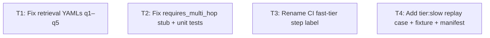
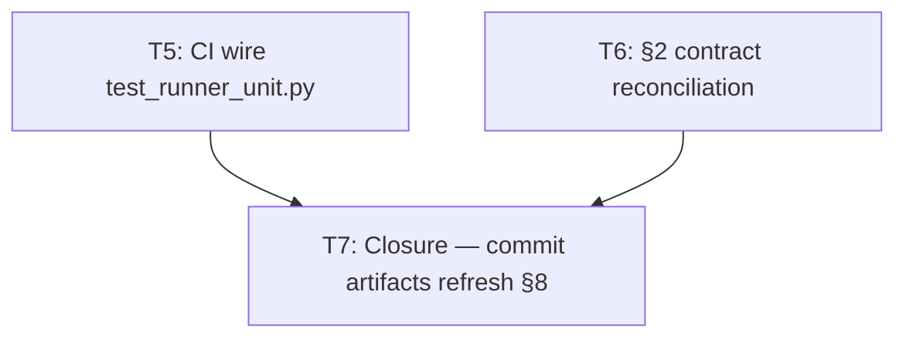

# Plan — phase-2-eval-honesty

**Version:** 1.2  
**Status:** Complete  
**Orchestrator skill:** orchestrator-planning v0.6  
**Packets:** `.dev/plans/phase-2-eval-honesty/packets/`

---

## §0 Context map intake

**Path consumed:** `.dev/plans/phase-2-eval-honesty/context-map.md`  
(promoted from `.dev/plans/_pending/phase-2-eval-honesty/context-map.md`)

**Readiness verdict:** CONDITIONAL

**Scope-area labels flagged:**
- Flag 1 — ownership: strategy selection (A/B/C) for G1 retrieval cases
- Flag 2 — vocabulary_collision: tier:slow semantics (workload vs CLI cap)
- Flag 3 — ownership: G4 slow-case source (live HybridRetriever vs recorded)
- Flag 4 — ownership: requires_multi_hop (implement validation vs remove stub)
- Flag 5 — ownership: CI step label (rename vs add minimal replay case)
- Flag 6 — missing_test_coverage: no unit tests for run_retrieval_check / run_replay_check
- Flag 7 — implicit_contract: Option C quarantine mechanism (recorded as non-blocking)

**Skill version + commit SHA (staleness check):**  
pre-plan-exploration v0.2 · commit `ee87002297a495389b9bc79a510966dd30ab23f7`

**Orchestrator resolutions for CONDITIONAL flags** (planning proceeds):

| Flag | Resolution |
|------|------------|
| Flag 1 | **Option A chosen** — synthetic `retrieved_context` for q1-q5. Rationale: lowest infrastructure delta; EvalRecorder recording script not wired; Option C does not improve honesty. |
| Flag 2 | tier:slow for G4 case is intended behavior — runs in nightly (`--golden-tier=slow`), skips in PR (`--golden-tier=fast`). |
| Flag 3 | **Recorded hand-authored JSON fixture** for G4 slow case. Rationale: live HybridRetriever not wired into golden runner (Surface 9); avoids live server dependency in CI. |
| Flag 4 | **Remove** the `sub["multi_hop_declared"] = True` always-pass stub from `run_retrieval_check`. Retain `requires_multi_hop` field in `ExpectRetrieval` schema as documentation-only metadata; no validator added. YAMLs retain field as-is. |
| Flag 5 | **Rename** CI fast-tier step label (drop "includes replay"). The new slow-tier replay case (T4) runs only in nightly, so the fast-tier step label remains honest without a fast-tier replay case. |
| Flag 6 | Add unit tests in `tests/eval/golden_set/test_runner_unit.py` (within golden_set scope; `tests/unit/` remains out of scope). |
| Flag 7 | Not in scope — Option C not chosen. |

---

## §1 Task statement

Phase 2 of the MVP eval-honesty pass makes the golden set's five failing medium-tier retrieval cases deterministically pass by filling their empty `retrieved_context` fields with keyword-matching synthetic text (Option A). It also removes a permanently-true sub-check stub for `requires_multi_hop` in the retrieval runner, renames a misleading CI step label ("includes replay" when no replay case exists), and adds one `tier:slow` replay case backed by a committed hand-authored JSON fixture to exercise the existing `run_replay_check` code path end-to-end. The Phase 2 exit criterion is a green `pytest tests/eval/golden_set/test_goldens.py --golden-tier=slow` run.

**Non-goals:**
- No live HybridRetriever calls in CI
- No recording script for EvalRecorder
- No changes to trace, security, contract, or edge case categories
- No changes to `tests/unit/` or `tests/integration/`
- No Phase 3 observability, Phase 4 CLI defaults, or Phase 5 doc hygiene
- No changes to `aria/llm/` or `aria/retrieval/hybrid_retriever.py`
- No changes to `tests/eval/graphrag_vs_vector_rag.py` or `DEFAULT_COMPONENT_KEYWORDS`
- No Option B wiring for medium-tier cases

---

## §2 Shared contracts

| Topic | Binding |
|-------|---------|
| **Types / interfaces** | `ExpectRetrieval.requires_multi_hop: bool` — field retained in `schema.py`, **no behavioral change** (sub-check stub removed in T2; field becomes declarative metadata). `Tier` type alias `Literal["fast", "medium", "slow"]` — unchanged. `ReplayFixture` dataclass fields (binding for T4 JSON fixture): `case_id: str`, `correlation_id: str`, `recorded_at: str`, `aria_commit: str`, `request: dict`, `response: dict`, `strategy_used: str` — owned by `recorder.py:ReplayFixture`. `response` dict keys consumed by `run_replay_check`: `answer` (str), `retrieval_strategy` (str), `sources` (list), `trace` (dict). |
| **Error envelope** | No new exception types. `run_retrieval_check` and `run_replay_check` return `CheckOutcome(passed=False, detail=<str>)` on failure — shape unchanged. |
| **Naming** | New slow case id: `eval-replay-gdpr-erasure`. New case file: `tests/eval/golden_set/cases/retrieval/q6_replay_gdpr_erasure.yaml`. New fixture file: `tests/eval/golden_set/replay/eval-replay-gdpr-erasure.json`. New unit test file: `tests/eval/golden_set/test_runner_unit.py`. Decision log path (architectural T2): `.dev/decision-logs/T2-requires-multi-hop.md`. |
| **Logging** | No new logging. |
| **Tests** | Framework: pytest. New unit tests in `tests/eval/golden_set/test_runner_unit.py` covering `run_retrieval_check` (pass + fail cases) and `run_replay_check` (pass with fixture). T1 exit: `pytest tests/eval/golden_set/test_goldens.py --golden-tier=medium` → 5 pass (was 5 fail). T2 exit: `pytest tests/eval/golden_set/test_runner_unit.py` → all pass. Phase 2 combined exit: `pytest tests/eval/golden_set/test_goldens.py --golden-tier=slow` → all pass including new slow replay case. |
| **CLI surface** | `--golden-tier=fast\|medium\|slow` — frozen, no change. Phase 2 verification command: `pytest tests/eval/golden_set/test_goldens.py --golden-tier=slow`. |
| **Decision log path** | `.dev/decision-logs/T2-requires-multi-hop.md` — architectural tier; this path is a contract anchor. T2 executor must create this file; auditors read it at handoff. |

**Typed-surface binding rule compliance:**
- `ReplayFixture` — owned by T4; typed parse path: `recorder.py:ReplayFixture(**raw)` via `load_replay_fixture`; round-trip test: `test_run_replay_check_with_fixture` in `test_runner_unit.py` (T2 creates test file; T4 fixture is the test input).
- `requires_multi_hop` on `ExpectRetrieval` — owned by T2; no validator added; test: `test_run_retrieval_check_passes_with_keywords` in `test_runner_unit.py` exercises path with `requires_multi_hop=True` confirming the field does not affect outcome.

---

## §3 Dependency DAG

**Parallel group: {T1, T2, T3, T4}** — all independent, no edges.

File touch sets are disjoint:
- T1 → `cases/retrieval/q1–q5.yaml` (existing, YAML body only)
- T2 → `runner.py`, `test_runner_unit.py` (new), `.dev/decision-logs/T2-requires-multi-hop.md` (new)
- T3 → `.github/workflows/ci.yml`
- T4 → `cases/retrieval/q6_replay_gdpr_erasure.yaml` (new), `replay/eval-replay-gdpr-erasure.json` (new), `manifest.yaml`

Zero file overlap across all four subtasks.

---

## §4 Subtask specs

---

### T1 — Fix retrieval YAML q1–q5 (Option A: synthetic `retrieved_context`)

**Scope:** Fill the empty `retrieved_context` field in all five medium-tier retrieval YAML files with synthetic template text that satisfies each case's `expected_components` keyword requirements as defined in `runner.py:DEFAULT_COMPONENT_KEYWORDS`. After this change, `run_retrieval_check` must return `passed=True` for all five cases.

**Files to touch:**
- `tests/eval/golden_set/cases/retrieval/q1_multi_hop_ai_act_gaps.yaml`
- `tests/eval/golden_set/cases/retrieval/q2_deadlines_teams.yaml`
- `tests/eval/golden_set/cases/retrieval/q3_cross_regulation.yaml`
- `tests/eval/golden_set/cases/retrieval/q4_single_hop_erasure.yaml`
- `tests/eval/golden_set/cases/retrieval/q5_systems_data_requirements.yaml`

**Contract bindings:** All §2 contracts. Do not modify `DEFAULT_COMPONENT_KEYWORDS`, `manifest.yaml`, or any non-retrieval YAML.

**Inputs:** None.

**Outputs:** Five YAML files with non-empty `retrieved_context` fields; `pytest tests/eval/golden_set/test_goldens.py --golden-tier=medium` passes (5 pass, 0 fail).

**Kill criteria:**
- HALT if any `expected_components` entry in a YAML file is absent from `DEFAULT_COMPONENT_KEYWORDS` and has no inline `component_keywords` override — report the missing key before writing any files.
- HALT if context-map Flag 1 is unresolved at execution start (strategy not confirmed as Option A in the plan).
- HALT if any YAML file already has a non-empty `retrieved_context` — verify all five are empty before editing (no silent overwrite of intentional data).
- HALT if editing a YAML file would introduce a key not present in the `GoldenCase` / `Expectations` schema.

**Log tier:** standard

**Risks & mitigations:**
- Synthetic context may contain semantically misleading regulatory claims. Mitigation: use neutral template language (e.g., "The [system] system must [requirement]") rather than accurate regulation prose.
- Coupling with `graphrag_vs_vector_rag.py` (Surface 1, 2): T1 must not modify `DEFAULT_COMPONENT_KEYWORDS` or `graphrag_vs_vector_rag.py`; the synthetic text only needs to satisfy runner.py's keyword table.

---

### T2 — Fix `requires_multi_hop` sub-check stub + add unit tests

**Scope:** Remove lines 198–199 of `runner.py` (`if spec.requires_multi_hop: sub["multi_hop_declared"] = True`) to eliminate the permanently-true sub-check. Retain `requires_multi_hop` in `schema.py:ExpectRetrieval` as documentation-only (no validator). Create `tests/eval/golden_set/test_runner_unit.py` with fast unit tests for `run_retrieval_check` (pass with keywords, fail with empty context) and `run_replay_check` (pass with a minimal in-memory fixture). Write the architectural decision log at `.dev/decision-logs/T2-requires-multi-hop.md`.

**Files to touch:**
- `tests/eval/golden_set/runner.py` (remove lines ~198–199)
- `tests/eval/golden_set/test_runner_unit.py` (new)
- `.dev/decision-logs/T2-requires-multi-hop.md` (new; create `.dev/decision-logs/` if absent)

**Contract bindings:** All §2 contracts. Decision log path is a §2 contract anchor. Unit test file location is a §2 naming contract.

**Inputs:** None.

**Outputs:** `runner.py` with stub removed; `test_runner_unit.py` with ≥3 passing tests; `.dev/decision-logs/T2-requires-multi-hop.md` with alternatives, rationale, and deferred items recorded.

**Kill criteria:**
- HALT if grep for `"multi_hop_declared"` outside `runner.py` returns any hits (test files, report.py, serialized JSON) — report before modifying.
- HALT if removing lines 198–199 would change `CheckOutcome.passed` for any case where `requires_multi_hop=False` — the field must have no effect on pass/fail outcome.
- HALT if context-map Flag 4 is unresolved at execution start (implement vs remove not confirmed as remove in the plan).
- HALT if `test_runner_unit.py` already exists at that path.
- HALT if the decision log path `.dev/decision-logs/T2-requires-multi-hop.md` conflicts with an existing file at that path.

**Log tier:** architectural  
**Decision log path:** `.dev/decision-logs/T2-requires-multi-hop.md` (§2 contract anchor)

**Risks & mitigations:**
- `sub["multi_hop_declared"]` key may be present in serialized `CaseResult.checks` in `report.py` output. Mitigation: kill criterion covers this; grep first.
- New test file in `tests/eval/golden_set/` is discovered by broad pytest invocations; tests must not require `--golden-tier` fixture or `mark=golden` (they are plain unit tests, not golden-set cases).
- Decision log supersession: if a later subtask contradicts this log's rationale, the later subtask's Outputs must include a supersession banner per §Log tier assignment rules.

---

### T3 — Rename CI fast-tier step label

**Scope:** Edit `.github/workflows/ci.yml` line 40 to rename the step from `"Golden set (fast tier, includes replay)"` to `"Golden set (fast tier)"`, removing the false "includes replay" claim. No other changes to the step's commands, environment, or conditions.

**Files to touch:**
- `.github/workflows/ci.yml`

**Contract bindings:** §2 CLI surface (frozen — no flag changes). §2 Naming (no new symbols).

**Inputs:** None.

**Outputs:** `ci.yml` with updated step name; YAML remains syntactically valid.

**Kill criteria:**
- HALT if context-map Flag 5 is unresolved at execution start (rename vs add replay case not confirmed as rename in the plan).
- HALT if any change beyond the step `name:` field is made (no pytest command, env, or condition changes).
- HALT if the new step name contains the word "replay" in any form.
- HALT if the ci.yml YAML is not syntactically valid after the edit — validate with `python -c "import yaml; yaml.safe_load(open('.github/workflows/ci.yml'))"`.

**Log tier:** trivial

**Risks & mitigations:**
- YAML indentation errors from editor auto-formatting. Mitigation: kill criterion 4 (YAML validation).

---

### T4 — Add `tier:slow` replay case + fixture + manifest entry

**Scope:** Create one new golden case YAML (`q6_replay_gdpr_erasure.yaml`) at `tier: slow` with an `expect.replay` block pointing to a hand-authored JSON fixture. Commit the fixture to `tests/eval/golden_set/replay/`. Add the case to `manifest.yaml`. The fixture must be authored to satisfy `run_replay_check`'s checks deterministically.

**Files to touch:**
- `tests/eval/golden_set/cases/retrieval/q6_replay_gdpr_erasure.yaml` (new)
- `tests/eval/golden_set/replay/eval-replay-gdpr-erasure.json` (new)
- `tests/eval/golden_set/manifest.yaml` (append one entry under the retrieval section)

**Contract bindings:** All §2 contracts. Case id, file path, and fixture filename are §2 naming anchors. `ReplayFixture` field names from §2 Types are binding for the JSON structure.

**Inputs:** None. (Fixture is hand-authored; T2's `test_runner_unit.py` may include a replay test that uses the same fixture shape — no blocking dependency, but coordination note: if T2 and T4 land in the same PR, T2's replay test must match T4's fixture.)

**Outputs:** `q6_replay_gdpr_erasure.yaml`; `eval-replay-gdpr-erasure.json`; updated `manifest.yaml`; `pytest tests/eval/golden_set/test_goldens.py --golden-tier=slow` green including the new case.

**Kill criteria:**
- HALT if context-map Flag 3 is unresolved at execution start (live vs recorded not confirmed as recorded hand-authored fixture in the plan).
- HALT if `run_replay_check` dispatch is not reachable for the new case — verify in `test_goldens.py` that `case.expect.replay is not None` triggers `run_replay_check` before finalizing YAML.
- HALT if `recorder.py:ReplayFixture` field names differ from the JSON keys being authored — read `recorder.py:load_replay_fixture` and confirm `ReplayFixture(**raw)` unpacking succeeds with the authored keys.
- HALT if `manifest.yaml` entry id/tier/file does not exactly match the YAML case fields.
- HALT if `test_manifest_coverage` fails after manifest entry is added (`pytest tests/eval/golden_set/test_goldens.py::test_manifest_coverage`).
- HALT if the new YAML case id `eval-replay-gdpr-erasure` already exists in the manifest or in any loaded case.

**Log tier:** standard

**Risks & mitigations:**
- Hand-authored fixture with wrong `response` field names → `run_replay_check` attribute errors. Mitigation: kill criterion 3; read `runner.py:run_replay_check` response access pattern (`fixture.response.get("answer")`, `.get("retrieval_strategy", fixture.strategy_used)`, `.get("sources", [])`, `.get("trace", {})`) before authoring.
- Surface 8 (suspected): E2E fixture shape may differ from replay fixture shape. Mitigation: the `response` dict keys are specified in §2 Types; fixture must use exactly those keys.
- Nightly becomes red if fixture is malformed. Mitigation: kill criteria 2–5 must all pass locally before merge.
- Manifest file-format drift (copy–paste tier typo). Mitigation: copy an existing manifest entry structure and diff carefully.

---

## §5 Adversarial pass

*(Framed from packet-only executor persona: each finding answers "If I only had the T<n> packet, I would halt because…")*

### 5.1 Rejected decompositions

1. **Option B for all five G1 cases instead of Option A** — Would require EvalRecorder wiring, a recording script, live server availability, and five committed fixture files (one per question). Infrastructure cost is high relative to the honesty gain; synthetic keyword-matching context is sufficient to make the lens deterministic. Rejected.

2. **Single "Big T1" subtask touching runner.py + YAMLs + CI + manifest** — Serializes all work, prevents parallel execution, and conflates concern domains (fixture authoring, code logic, CI ops). Separating into four parallel tasks with disjoint file sets is safer and faster. Rejected.

3. **Fix G1 only; defer G3/G4/G2 to a later phase** — Leaves `sub["multi_hop_declared"]` dead code, CI label misleading, and `run_replay_check` unexercised. MVP_PICKUP.md explicitly calls all four goals as one phase. Rejected.

### 5.2 Load-bearing assumptions

- `(DEFAULT_COMPONENT_KEYWORDS covers all expected_components listed in q1–q5 | runner.py:DEFAULT_COMPONENT_KEYWORDS dict ↔ cases/retrieval/q*.yaml ExpectRetrieval.expected_components | if a YAML lists a component key absent from DEFAULT_COMPONENT_KEYWORDS and with no inline component_keywords override, run_retrieval_check always fails regardless of context | T1)` — Context map surface 1 states 9 component keys; executor must verify each YAML's expected_components is a subset of the 9 keys before writing synthetic text.

- `(run_replay_check dispatch is reachable from test_goldens.py | test_goldens.py lens dispatch logic ↔ GoldenCase.expect.replay presence | if dispatch is gated by a guard not visible in context map, T4's new case silently doesn't exercise the check | T4)` — Context map notes run_replay_check is "unreachable until YAML declares expect.replay"; adding the YAML should enable it. T4 kill criterion 2 requires executor to verify dispatch before finalizing.

- `(sub["multi_hop_declared"] is not consumed outside runner.py | runner.py sub dict ↔ report.py CaseResult.checks, test_goldens assertions, eval_store.py | if any downstream code reads this key by name, removing it silently changes serialized output | T2)` — Context map surface 7 notes only runner.py writes it; T2 kill criterion 1 mandates grep before removal.

- `(ReplayFixture(**raw) unpacking succeeds with JSON authored by T4 | recorder.py:load_replay_fixture ↔ ReplayFixture dataclass field names ↔ T4 JSON keys | wrong key names → TypeError at fixture load | T4)` — §2 Types names the binding fields; T4 kill criterion 3 requires executor to verify before authoring.

### 5.3 Highest re-plan risk

**T4.** Crafting a hand-authored replay fixture that passes all `run_replay_check` sub-checks (fixture_exists, has_answer, strategy_match, min_sources, trace keys, quality sub-checks) requires precise reading of runner.py's fixture access pattern. If the quality sub-check's `must_mention` keywords are not present in the authored answer, or if `min_source_count` is under-provisioned in the fixture's `sources` list, the slow case fails and requires iteration. This is a technical surprise, not a process risk.

### 5.4 Hidden couplings

- `(DEFAULT_COMPONENT_KEYWORDS lexicon used independently by runner.py and graphrag_vs_vector_rag.py | runner.py:DEFAULT_COMPONENT_KEYWORDS ↔ graphrag_vs_vector_rag.py:score_retrieval inline dict | T1's synthetic context satisfies runner.py keywords but graphrag tests maintain a separate inline keyword table; if T1 executor modifies DEFAULT_COMPONENT_KEYWORDS instead of writing YAML text, graphrag tests diverge | T1)` — **confirmed** (context map Surface 1).

- `(manifest.yaml must stay in sync with all YAML case files | manifest.yaml cases[].id/tier/file ↔ loader.py:validate_manifest_coverage | T4 adds a new case; omitted or mismatched manifest entry fails test_manifest_coverage | T4)` — **confirmed** (context map Surface 3).

- `(sub["multi_hop_declared"] key may appear in CheckOutcome.sub_checks serialized by report.py or consumed by test_goldens | runner.py sub dict ↔ report.py CaseResult.checks ↔ eval_store.py JSON output | removing key changes serialized report shape for any case with requires_multi_hop=True | T2)` — **suspected** (no confirmed external reader found; T2 kill criterion 1 mandates pre-removal grep to confirm or disprove).

- `(T2 test_runner_unit.py replay test and T4 fixture must use identical response field names | test_runner_unit.py inline fixture dict ↔ eval-replay-gdpr-erasure.json response keys | if T2 authors an inline fixture with different keys than T4's committed JSON, one test passes and the other fails | T2, T4)` — **suspected** soft dependency when both land in the same PR. Mitigation: T2 packet includes the §2-binding response key list; T4 packet does the same.

---

## §6 Executor packets

Packets emitted at:
- `.dev/plans/phase-2-eval-honesty/packets/T1.md`
- `.dev/plans/phase-2-eval-honesty/packets/T2.md`
- `.dev/plans/phase-2-eval-honesty/packets/T3.md`
- `.dev/plans/phase-2-eval-honesty/packets/T4.md`

Each packet is self-contained (§1 verbatim, §2 verbatim, subtask block verbatim, filtered §5.2 / §5.4 items).

---

## Plan v1.2 — amendment extension (2026-05-30)

**Audit consumed:** `.dev/audits/2026-05-30-phase-2-eval-honesty.md`  
**Audit verdict:** **fail** — majors **F-01** (plan §8 not at `HEAD`), **F-03** (`test_runner_unit.py` not in CI)  
**Non-goals (amendment):** Revert T1–T4 code; implement real `requires_multi_hop` validation; golden negative for keyword-mismatch context (F-06); committed-fixture unit test without mock (F-05); MVP_PICKUP / AUDIT_DIGEST sync (F-08 — Phase 5); Option B/C retrieval wiring.

**Packet paths:** `.dev/plans/phase-2-eval-honesty/packets/T5.md`, `T6.md`, `T7.md`

### Amendment dependency DAG

**Parallel group: {T5, T6}** — disjoint file sets. **T7** requires both.

---

## §7 Amendment subtasks

*Original T1–T4 specs and §§0–6 above are unchanged. Remediation closes audit majors F-01, F-03 and minor F-04; F-07 fixed in T7 §8.1 edit.*

---

### T5 — Wire runner unit tests into PR CI (F-03)

| Field | Content |
|-------|---------|
| **ID** | T5 |
| **Scope** | Extend `.github/workflows/ci.yml` golden-set step so `pytest tests/eval/golden_set/test_runner_unit.py` runs on every PR. Without this, reintroducing the `multi_hop_declared` stub would not fail medium/slow goldens (keyword-only pass); only unit tests gate stub regression. |
| **Files to touch** | `.github/workflows/ci.yml` (golden-set step `run:` block only) |
| **Contract bindings** | §2 Tests (`test_runner_unit.py` must be CI-gated post-amendment). §2 CLI surface unchanged. Amendment §2 Tests *Landed:* row (T6 lands narrative; T5 lands behavior). |
| **Inputs** | T1–T4 complete; audit F-03 |
| **Outputs** | CI step invokes `test_runner_unit.py` after or alongside existing `test_goldens.py --golden-tier=fast` invocation; local exit: `pytest tests/eval/golden_set/test_runner_unit.py -q` → all pass. |
| **Kill criteria** | (a) HALT if any change outside the `Golden set (fast tier)` step's `run:` script (no env, `name:`, or other step edits). (b) HALT if `-m golden` is applied to a combined invocation that excludes `test_runner_unit.py` (unit file has no `golden` mark). (c) HALT if `test_runner_unit.py` is absent at HEAD. (d) HALT if workflow YAML fails `python -c "import yaml; yaml.safe_load(open('.github/workflows/ci.yml'))"`. |
| **Log tier** | standard |
| **Risks & mitigations** | Nightly still omits unit file unless explicitly added — audit prioritized PR; optional second line in `nightly.yml` golden step is out of scope unless executor confirms <5 min job budget headroom and audit re-run requests it. |

---

### T6 — §2 contract reconciliation (F-04)

| Field | Content |
|-------|---------|
| **ID** | T6 |
| **Scope** | Append **§2 Amendment — contract deltas** (below) into this plan's v1.2 extension block. Align §2 Tests prose with shipped symbol `test_run_replay_check_passes_with_inline_fixture`. Record T5 CI wiring intent in CHANGELOG. No code changes unless kill criterion (b) fires. |
| **Files to touch** | `.dev/plans/phase-2-eval-honesty/plan.md` (append *Landed:* rows under v1.2 §2 Amendment only), `CHANGELOG.md`, `.dev/decision-logs/T2-requires-multi-hop.md` (plan version header line only) |
| **Contract bindings** | Amendment §2 block. Original §2 rows in §§0–6 remain read-only. |
| **Inputs** | T1–T4 complete; audit F-04 |
| **Outputs** | (1) §2 Amendment — contract deltas present under v1.2 extension. (2) CHANGELOG entry for plan v1.2 amendment / T5–T7. (3) Decision log header references plan v1.2. |
| **Kill criteria** | (a) HALT if amendment edits prose in original §§0–6 or §8 except where T7 owns §8.1/§8.6 updates. (b) HALT if shipped test function name at `tests/eval/golden_set/test_runner_unit.py` differs from audit evidence and reconciliation requires renaming tests (escalate — prefer plan *Landed:* over rename). (c) HALT if `test_run_replay_check_passes_with_inline_fixture` is absent at HEAD. |
| **Log tier** | standard |
| **Risks & mitigations** | Copy test name from HEAD `test_runner_unit.py`, not from original §2 Typed-surface bullet. |

---

### T7 — Plan closure, audit commit, context map refresh (F-01, F-02, F-07)

| Field | Content |
|-------|---------|
| **ID** | T7 |
| **Scope** | Commit plan v1.1+§8 (if not at `HEAD`), commit audit artifact, refresh `context-map.md` with closure SHA and *Post-execution* staleness note. Update §8.1 (closure SHA, clean-tree verification, remove false “clean at handoff” claim per F-07). Add §8.6 audit remediation cross-link. Re-run §8.1 verification commands on **clean checkout** at post-amendment closure SHA (includes T5 CI change committed). |
| **Files to touch** | `.dev/plans/phase-2-eval-honesty/plan.md` (§8.1, §8.4 F-01/F-03 disposition, §8.6 new), `.dev/plans/phase-2-eval-honesty/context-map.md`, `.dev/audits/2026-05-30-phase-2-eval-honesty.md` (commit if untracked) |
| **Contract bindings** | §8 auditor handoff schema (orchestrator-planning v0.6 §8). Context map SHA must match closure SHA. |
| **Inputs** | T5 (CI wired), T6 (§2 Amendment landed) |
| **Outputs** | (1) `git show HEAD:.dev/plans/phase-2-eval-honesty/plan.md` shows v1.2 with §8 and v1.2 amendment block. (2) Audit file at `HEAD`. (3) Context map *Post-execution* section with HEAD SHA. (4) §8.1 records actual closure SHA; §8.6 links audit + T5–T7. (5) §8.4 marks F-01, F-03 **closed** with evidence. |
| **Kill criteria** | (a) HALT if T5 or T6 not complete. (b) HALT if §8.1 verification runs on dirty tree (stash/commit unrelated changes first). (c) HALT if any §8.2 path fails `git show HEAD:<path>` at recorded closure SHA. (d) HALT if `ci.yml` at HEAD still lacks `test_runner_unit.py` invocation (F-03 not closed). |
| **Log tier** | standard |
| **Risks & mitigations** | Closure SHA will differ from audit SHA `3a60717`. Record post-amendment SHA in §8.1, not audit SHA. Do not commit unrelated `uv.lock` churn unless user requests. |

---

### §2 Amendment — contract deltas (T6 lands; binding post-v1.2)

| Topic | *Landed:* delta |
|-------|-----------------|
| **Tests — replay round-trip symbol** | Shipped name: `test_run_replay_check_passes_with_inline_fixture` in `tests/eval/golden_set/test_runner_unit.py` (supersedes original §2 Typed-surface reference to `test_run_replay_check_with_fixture`). Golden slow tier still provides on-disk `eval-replay-gdpr-erasure.json` E2E round-trip. |
| **Tests — CI gate for runner unit file** | PR CI: `.github/workflows/ci.yml` `Golden set (fast tier)` step runs `pytest tests/eval/golden_set/test_runner_unit.py` (owned by T5). Verification: inspect workflow at HEAD; local `pytest tests/eval/golden_set/test_runner_unit.py -q` → all pass. |
| **Tests — deferred (unchanged)** | F-05 committed-fixture unit load without mock; F-06 golden negative for wrong `retrieved_context` — remain deferred per audit §14. |

---

## §8 Auditor handoff

### §8.1 Completion snapshot

- **Tree SHA:** `26b05116b7fc01fc422706c40a5eb32722a24383`
- **Working tree:** clean at closure commit (plan §8 and audit committed at this SHA; unrelated `uv.lock` churn excluded per amendment non-goals)
- **Verification (clean checkout at closure SHA):**
  - `pytest tests/eval/golden_set/test_runner_unit.py -q` → **5 passed**
  - `pytest tests/eval/golden_set/test_goldens.py --golden-tier=slow -q` → **33 passed**
- **Exit code:** 0

### §8.2 Artifact chain

| Order | Path |
|-------|------|
| 1 | `.dev/plans/phase-2-eval-honesty/context-map.md` (scout SHA `ee870022`; closure SHA in *Post-execution*) |
| 2 | `.dev/plans/phase-2-eval-honesty/plan.md` (v1.2 + §8 + amendment) |
| 3 | `.dev/plans/phase-2-eval-honesty/packets/T{1..4}.md` |
| 4 | `.dev/decision-logs/T2-requires-multi-hop.md` |
| 5 | `.dev/audits/2026-05-30-phase-2-eval-honesty.md` |
| 6 | `CHANGELOG.md` § phase-2-eval-honesty |
| 7 | `tests/eval/golden_set/test_runner_unit.py` |
| 8 | `tests/eval/golden_set/replay/eval-replay-gdpr-erasure.json` |
| 9 | `tests/eval/golden_set/cases/retrieval/q{1..6}_*.yaml` |
| 10 | `.github/workflows/ci.yml` (golden-set step) |

### §8.3 §2 evidence (per-row)

| §2 row | Landed artifact | Test / check |
|--------|-----------------|--------------|
| `requires_multi_hop` declarative only | `schema.py`, `runner.py` (stub removed) | `test_run_retrieval_check_requires_multi_hop_does_not_affect_outcome` |
| `ReplayFixture` + `load_replay_fixture` | `eval-replay-gdpr-erasure.json` | `test_goldens.py --golden-tier=slow` (q6 replay) |
| Replay unit symbol | `test_run_replay_check_passes_with_inline_fixture` | `test_runner_unit.py` |
| CI gate for runner unit file | `.github/workflows/ci.yml` | `pytest tests/eval/golden_set/test_runner_unit.py` in PR golden step |
| Medium retrieval honesty (Option A) | q1–q5 `retrieved_context` | `--golden-tier=medium` (5 retrieval pass) |
| Decision log path | `.dev/decision-logs/T2-requires-multi-hop.md` | present at HEAD |

**§2 Amendment rows (*Landed:* — T6):**

| §2 Amendment row | Landed artifact | Test / check |
|------------------|-----------------|--------------|
| Replay round-trip symbol | `test_run_replay_check_passes_with_inline_fixture` | 5 passed in `test_runner_unit.py` |
| CI gate for runner unit file | `ci.yml` golden step line 44 | local + PR workflow |

### §8.4 §5 / audit disposition

| Item | Status | Notes |
|------|--------|-------|
| F-01 plan §8 not at `HEAD` | **closed** | T7 — plan v1.2 + §8 committed at closure SHA |
| F-02 context map stale | **closed** | T7 — *Post-execution* section with closure SHA |
| F-03 `test_runner_unit.py` not in CI | **closed** | T5 — `ci.yml` golden step |
| F-04 §2 replay test name drift | **closed** | T6 — §2 Amendment *Landed:* row |
| F-05 committed-fixture unit without mock | **open** | Deferred per audit §14 |
| F-06 golden negative wrong `retrieved_context` | **open** | Deferred per CHANGELOG T1 |
| F-07 §8.1 false clean-tree claim | **closed** | T7 — wording in §8.1 |
| F-08 MVP_PICKUP / AUDIT_DIGEST sync | **open** | Phase 5 non-goal |
| §5.2 graphrag keyword coupling (Surface 1) | **closed** | T1 YAML-only; no `DEFAULT_COMPONENT_KEYWORDS` edit |
| §5.4 manifest ↔ q6 sync (Surface 3) | **closed** | `test_manifest_coverage` |

### §8.5 Cold-read seeds

1. `tests/eval/golden_set/runner.py` (`run_retrieval_check`, `run_replay_check`)
2. `tests/eval/golden_set/test_runner_unit.py`
3. `tests/eval/golden_set/replay/eval-replay-gdpr-erasure.json`
4. `.github/workflows/ci.yml` (golden-set step)
5. `.dev/audits/2026-05-30-phase-2-eval-honesty.md`

### §8.6 Audit remediation cross-link

| Audit finding | Remediation | Evidence |
|---------------|-------------|----------|
| F-01 | T7 — commit plan v1.2 + §8 at HEAD | `git show HEAD:.dev/plans/phase-2-eval-honesty/plan.md` |
| F-03 | T5 — CI runs `test_runner_unit.py` | `ci.yml` golden step |
| F-04 | T6 — §2 Amendment test name | plan v1.2 §2 Amendment |
| F-07 | T7 — §8.1 wording fix | §8.1 |
