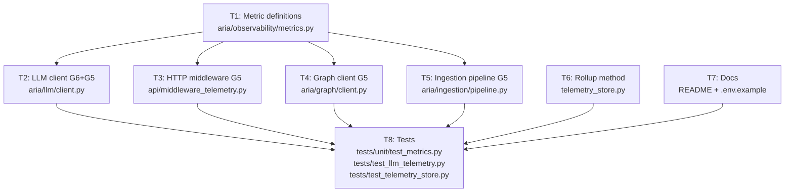

# Plan: phase-3-observability

**Version:** 1.0  
**Status:** Active  
**Owner:** Ale  
**Plan dir:** `.dev/plans/phase-3-observability/`

---

## §0 Context map intake

**Path consumed:** `.dev/plans/phase-3-observability/context-map.md`  
*(Promoted from `.dev/plans/_pending/phase-3-observability/context-map.md` at planning time; `_pending/` path is retired.)*

**Readiness verdict:** CONDITIONAL

**Skill version + commit SHA:** pre-plan-exploration v0.2 · `ee87002297a495389b9bc79a510966dd30ab23f7`

**Staleness check:** The working tree is dirty at map generation (exploration artifacts only; no in-scope application files modified). Touched application files must be verified at execution start by executor.

**Scope-area ambiguity flags resolved at orchestrator level (§5.2 records the residual uncertainty):**

| Flag | Category | Orchestrator Decision |
|------|----------|-----------------------|
| 1 | vocabulary_collision | `INGESTION_DURATION` in pipeline uses `fmt.value` → `"pdf"` \| `"html"`. These are distinct from HTTP smoke values `"text"` / `"file"`. No label unification. |
| 2 | ownership_ambiguity | HTTP duration histogram labels: `method` + `status_code` only. `path` label rejected (cardinality risk; aligns with `telemetry-audit.md`). |
| 3 | ownership_ambiguity | Per-request cost rollup: store-only SQL method `TelemetryStore.cost_by_request(request_id: str) -> float \| None`. No `/telemetry` JSON change. |
| 4 | missing_test_coverage | T8 must cover `aria_telemetry_write_errors_total{source="llm"}` via forced mock SQLite failure in both `record_llm_call` sites in `LLMClient.complete`. |
| 5 | vocabulary_collision | Document Ollama `cost_usd=None` in **both** `README.md` and `.env.example`. |

All five flags are resolved; plan proceeds without CONDITIONAL kill criteria on these flags.

---

## §1 Task statement

Phase 3 closes the observability gaps identified in `MVP_PICKUP.md §189–195` (G5 and G6). G6 replaces two silent `except Exception: pass` swallows in `aria/llm/client.py` with the warning-log + `TELEMETRY_WRITE_ERRORS_COUNTER.labels(source="llm")` pattern already used by the HTTP middleware and agent layer. G5 adds three missing Prometheus metrics — an HTTP request duration histogram (`aria_http_request_duration_seconds`), a graph query duration histogram (`aria_graph_query_duration_seconds`), and an LLM cost counter (`aria_llm_cost_usd_total`) — and wires observe/increment calls at their respective sites: `TelemetryMiddleware.dispatch`, `Neo4jClient.execute_read/write`, `ingest_document()` pipeline completion path, and `LLMClient.complete`. A store-only per-request cost rollup method is added to `TelemetryStore` for future operator tooling without changing the `/telemetry` JSON contract. Ollama's `cost_usd=None` semantics are documented in both `README.md` and `.env.example`.

**Non-goals:**
- No changes to `api/routers/telemetry.py` JSON shape or `GET /telemetry` response contract.
- No label unification between HTTP smoke ingest (`text`/`file`) and pipeline ingest (`pdf`/`html`).
- No `path` label on any histogram.
- No new metrics for agent, retrieval, or MCP layers (already instrumented).
- No changes to `api/routers/ingest.py` (HTTP smoke ingest already observes `INGESTION_DURATION`).
- No Phase 2 eval or other MVP phases.

---

## §2 Shared contracts

### Types / interfaces

| Symbol | Location (owning subtask) | Typed surface | Round-trip / construction test |
|--------|--------------------------|---------------|-------------------------------|
| `HTTP_REQUEST_DURATION` | `aria/observability/metrics.py` (T1) | Module-level `Histogram` constant | T8: `REGISTRY.get_sample_value("aria_http_request_duration_seconds_count", ...)` after HTTP request |
| `GRAPH_QUERY_DURATION` | `aria/observability/metrics.py` (T1) | Module-level `Histogram` constant | T8: `_histogram_count("aria_graph_query_duration_seconds", {"query_name": "read"})` delta check |
| `LLM_COST_COUNTER` | `aria/observability/metrics.py` (T1) | Module-level `Counter` constant | T8: `_counter_value(LLM_COST_COUNTER, model=...)` delta check |
| `TelemetryStore.cost_by_request` | `aria/observability/telemetry_store.py` (T6) | Instance method; `(request_id: str) -> float \| None` | T8: unit test in `tests/test_telemetry_store.py` |

**Metric definitions (frozen — all downstream packets must copy these verbatim):**

```python
HTTP_REQUEST_DURATION = Histogram(
    "aria_http_request_duration_seconds",
    "HTTP request latency in seconds",
    ["method", "status_code"],
    buckets=[0.005, 0.01, 0.025, 0.05, 0.1, 0.25, 0.5, 1.0, 2.5, 5.0],
)

GRAPH_QUERY_DURATION = Histogram(
    "aria_graph_query_duration_seconds",
    "Neo4j query execution time in seconds",
    ["query_name"],
    buckets=[0.001, 0.005, 0.01, 0.025, 0.05, 0.1, 0.25, 0.5, 1.0],
)

LLM_COST_COUNTER = Counter(
    "aria_llm_cost_usd_total",
    "Accumulated LLM cost in USD (Ollama: always 0, not incremented)",
    ["model"],
)
```

### Error envelope

G6 pattern — both `except Exception: pass` sites in `LLMClient.complete` become:
```python
except Exception as exc:
    TELEMETRY_WRITE_ERRORS_COUNTER.labels(source="llm").inc()
    logger.warning("telemetry store write failed: %s", type(exc).__name__)
```
- `source` label value `"llm"` is new and must match exactly.
- Exception type logged as string only (no traceback) — matches existing `http_middleware`, `agent`, `orchestration` pattern (confirmed via `aria/agents/base.py`, `api/middleware_telemetry.py`).
- Prometheus counter incremented unconditionally *after* the try/except (counters must not be swallowed).

### Naming

| New Python symbol | Prometheus metric name |
|-------------------|-----------------------|
| `HTTP_REQUEST_DURATION` | `aria_http_request_duration_seconds` |
| `GRAPH_QUERY_DURATION` | `aria_graph_query_duration_seconds` |
| `LLM_COST_COUNTER` | `aria_llm_cost_usd_total` |
| `TelemetryStore.cost_by_request` | (no Prometheus equivalent) |

### Logging

- G6 warning string: `"telemetry store write failed: %s"` with `type(exc).__name__` — no traceback, consistent with existing pattern.
- No new structured fields introduced.

### Tests

- Framework: `pytest` + `pytest-asyncio`.
- Prometheus checks: delta pattern via `_counter_value(metric, **labels)` or `_histogram_count(name, labels)` (existing helpers in `tests/unit/test_metrics.py`).
- G6 tests: mock `aria.observability.telemetry_store.TelemetryStore.record_llm_call` to raise `sqlite3.OperationalError`; assert counter incremented and warning logged.
- New test classes/functions land in existing test files where scope matches (see §4 T8).
- No new test files required; no integration tests (unit/mock only).

### CLI surface

N/A — no CLI flags introduced or consumed by downstream subtasks.

### Decision log paths

No subtask is `architectural` tier. No decision logs required.

---

## §3 Dependency DAG



**Parallel groups:**
- `{T6, T7}` may run immediately (no dependency on T1).
- `{T2, T3, T4, T5}` may run in parallel after T1 completes (disjoint files).
- T8 requires all of T1–T7.

**Soft dependencies:**
- T6 informally depends on the G5/G6 cost semantics decided in §2, but needs no code output from T2. Safe to parallelize.

---

## §4 Subtask specs

---

### T1 — Metric definitions

**ID:** T1  
**Scope:** Add three new Prometheus metric constants to `aria/observability/metrics.py`. No other file touched.  
**Files to touch:** `aria/observability/metrics.py`  
**Contract bindings:** §2 Types/interfaces (all three symbols), §2 Naming (frozen metric names and Python names), §2 Tests (registry check)  
**Inputs:** None  
**Outputs:** Three new module-level constants (`HTTP_REQUEST_DURATION`, `GRAPH_QUERY_DURATION`, `LLM_COST_COUNTER`) with exact definitions from §2. The `prometheus_client` import already includes `Counter` and `Histogram`; no new imports needed.  
**Kill criteria:**
- Halt if `prometheus_client` registration raises `ValueError` (duplicate metric name) — indicates a name collision with an existing metric; do not rename unilaterally, report the collision.
- Halt if the §2 bucket sequences or label arrays differ from what is written above — do not choose alternative buckets without re-plan.

**Log tier:** `standard`  
**Risks & mitigations:** Import side-effect registration means any test that imports `metrics.py` before this subtask runs will not see the new symbols. Mitigation: T8 imports must be explicit; existing tests are unaffected (they don't import the new symbols).

---

### T2 — LLM client G6 fix + G5 cost counter

**ID:** T2  
**Scope:** In `aria/llm/client.py`: (a) replace both `except Exception: pass` sites with the §2 error-envelope pattern; (b) import `TELEMETRY_WRITE_ERRORS_COUNTER` and `LLM_COST_COUNTER` from `aria.observability.metrics`; (c) increment `LLM_COST_COUNTER` when `cost` is not `None` on the success path.  
**Files to touch:** `aria/llm/client.py`  
**Contract bindings:** §2 Types/interfaces (`LLM_COST_COUNTER`), §2 Error envelope (G6 pattern verbatim), §2 Naming, §2 Logging  
**Inputs:** T1 (symbols `TELEMETRY_WRITE_ERRORS_COUNTER` already exists; `LLM_COST_COUNTER` introduced in T1)  
**Outputs:** Modified `aria/llm/client.py`; both silent swallows replaced; cost counter wired.

**Implementation notes:**
- Success path (inside `for attempt` loop, after `record_llm_call`): replace `except Exception: pass` → `except Exception as exc: TELEMETRY_WRITE_ERRORS_COUNTER.labels(source="llm").inc(); logger.warning(...)`. Then after `LLM_CALL_COUNTER.labels(...).inc()` add: `if cost is not None: LLM_COST_COUNTER.labels(model=self.model).inc(cost)`.
- Error path (attempt == max_retries, after `record_llm_call` on failure): same `except Exception: pass` → same G6 pattern.
- `LLM_CALL_COUNTER` and `LLM_CALL_DURATION` already outside the swallow block — do not move them.
- `LLM_COST_COUNTER` increment goes **outside** the SQLite try block (after it), consistent with the agents/base.py pattern (Prometheus outside SQLite try).

**Kill criteria:**
- Halt if either `except Exception: pass` site is not found at the expected location (lines ~237, ~277 at map commit SHA) — do not guess; report lines found and stop.
- Halt if `LLM_COST_COUNTER` is not yet defined (T1 not complete) — do not stub.
- Halt if changing the except block would also catch the `LLM_CALL_COUNTER.inc()` or `LLM_CALL_DURATION.observe()` calls — those must remain outside any swallow.

**Log tier:** `standard`  
**Risks & mitigations:** Two separate `except Exception: pass` sites must each be fixed; missing one leaves a silent swallow. Mitigation: grep the file for `except Exception` before and after edit to confirm count changes from 2 to 0.

---

### T3 — HTTP middleware duration histogram

**ID:** T3  
**Scope:** In `api/middleware_telemetry.py`, add `HTTP_REQUEST_DURATION` observe inside the existing `try` block in `TelemetryMiddleware.dispatch`, after the `HTTP_REQUEST_COUNTER.inc()` call.  
**Files to touch:** `api/middleware_telemetry.py`  
**Contract bindings:** §2 Types/interfaces (`HTTP_REQUEST_DURATION`), §2 Naming  
**Inputs:** T1  
**Outputs:** Modified `api/middleware_telemetry.py`

**Implementation notes:**
- Add `HTTP_REQUEST_DURATION` to the import from `aria.observability.metrics`.
- Observe: `HTTP_REQUEST_DURATION.labels(method=request.method, status_code=str(status_code)).observe(latency_ms / 1000.0)` — note conversion to seconds; labels match §2 (`method`, `status_code`).
- Place this call immediately after `HTTP_REQUEST_COUNTER.labels(...).inc()` (inside the `try`).
- The `latency_ms` variable is already computed at the top of the `finally` block.

**Kill criteria:**
- Halt if `HTTP_REQUEST_DURATION` is not yet importable (T1 not complete).
- Halt if `latency_ms` is not in scope at the observe site — do not compute a new timer.
- Halt if the observe call would be placed inside a nested try that could silently swallow histogram errors independently of the outer try.

**Log tier:** `standard`  
**Risks & mitigations:** `_SKIP_PATHS` guards the entire telemetry block; histogram observe is inside that guard, consistent with counter. Health/ready/metrics/telemetry paths will not generate observations — this is intentional.

---

### T4 — Graph client duration histogram

**ID:** T4  
**Scope:** In `aria/graph/client.py`, add `GRAPH_QUERY_DURATION` observe to `execute_read` and `execute_write`. Import `time` (stdlib) and `GRAPH_QUERY_DURATION`.  
**Files to touch:** `aria/graph/client.py`  
**Contract bindings:** §2 Types/interfaces (`GRAPH_QUERY_DURATION`), §2 Naming  
**Inputs:** T1  
**Outputs:** Modified `aria/graph/client.py`

**Implementation notes:**
- Add `import time` (stdlib) at top.
- Add `GRAPH_QUERY_DURATION` to metrics import line.
- In `execute_read`: record `_start = time.monotonic()` before `GRAPH_QUERY_COUNTER.labels(...).inc()`, then after collecting results add `GRAPH_QUERY_DURATION.labels(query_name="read").observe(time.monotonic() - _start)`. Label value `"read"` matches existing counter label.
- In `execute_write`: same pattern with `query_name="write"`.
- `health_check()` calls `execute_read` → will generate observations; acceptable.
- Duration covers: counter increment + session acquisition + `session.run` + async record fetch. This is the full query wall time operators care about.

**Kill criteria:**
- Halt if `GRAPH_QUERY_DURATION` is not yet importable (T1 not complete).
- Halt if `execute_read` or `execute_write` signatures change (different parameter names) — do not adapt silently; report and stop.

**Log tier:** `standard`  
**Risks & mitigations:** If `session()` context manager raises (e.g. driver not connected), the observe call is never reached — the exception propagates normally; no silent swallow introduced.

---

### T5 — Ingestion pipeline duration histogram

**ID:** T5  
**Scope:** In `aria/ingestion/pipeline.py`, import `INGESTION_DURATION` and `time`, then observe `INGESTION_DURATION.labels(format=fmt.value).observe(elapsed)` at the pipeline completion path (final `return result` only — not PARSE_ERROR or SKIPPED_DUPLICATE early returns).  
**Files to touch:** `aria/ingestion/pipeline.py`  
**Contract bindings:** §2 Types/interfaces (`INGESTION_DURATION` is existing; label decision from §0 Flag 1 resolution), §2 Naming  
**Inputs:** T1 (confirms `INGESTION_DURATION` still has `format` label; no change to its definition)  
**Outputs:** Modified `aria/ingestion/pipeline.py`

**Implementation notes:**
- Add `import time` to imports.
- Add `INGESTION_DURATION` to the metrics import (it already exists in `aria.observability.metrics`; just needs importing here).
- Timer placement: insert `_ingest_start = time.monotonic()` immediately **after** the successful `_parse_document` call (after the `except` block that returns PARSE_ERROR). This ensures `fmt` and `_ingest_start` are both in scope for the final observe.
- Observe placement: immediately before the final `return result` (line 198 at map commit), after all pipeline stages (chunking, entity extraction, graph write, vector indexing, Neo4j dedup). Formula: `INGESTION_DURATION.labels(format=fmt.value).observe(time.monotonic() - _ingest_start)`.
- Do NOT add observe to the PARSE_ERROR returns (lines 120, 126) or the SKIPPED_DUPLICATE return (line 135).
- `fmt.value` is `"pdf"` or `"html"` (from `DocumentFormat(StrEnum)`). These are distinct from HTTP smoke route values (`"text"`, `"file"`).

**Kill criteria:**
- Halt if `_parse_document` try/except block structure has changed and the correct insertion point for `_ingest_start` is ambiguous — do not guess; report the current structure.
- Halt if `fmt` is not in scope at the final return (would indicate a structural refactor) — report and stop.
- Halt if `INGESTION_DURATION` label list has been changed from `["format"]` to something else — do not adapt label call; report.

**Log tier:** `standard`  
**Risks & mitigations:** The early SKIPPED_DUPLICATE path is intentionally not observed; if an operator wants to measure skip latency they can add a separate counter later. The timer starts after parse, not before — parse failures won't skew the distribution.

---

### T6 — Per-request cost rollup method

**ID:** T6  
**Scope:** Add `TelemetryStore.cost_by_request(request_id: str) -> float | None` to `aria/observability/telemetry_store.py`. No other changes.  
**Files to touch:** `aria/observability/telemetry_store.py`  
**Contract bindings:** §2 Types/interfaces (`TelemetryStore.cost_by_request` signature and return semantics)  
**Inputs:** None  
**Outputs:** Modified `aria/observability/telemetry_store.py`

**Implementation notes:**
- Method signature: `def cost_by_request(self, request_id: str) -> float | None:`
- SQL: `SELECT SUM(cost_usd) FROM llm_calls WHERE request_id = ? AND cost_usd IS NOT NULL` via `self._conn` under `self._lock`.
- Return `float(row[0])` if `row[0] is not None`, else `None`.
- `None` means no rows with non-null `cost_usd` for that `request_id` (typical for Ollama calls or requests with no LLM calls).
- This method is informational only; it is not called by any other in-scope subtask. Operators may invoke it via scripts or future tooling.

**Kill criteria:**
- Halt if `llm_calls` table schema differs from `(id, request_id, model, ..., cost_usd REAL, ...)` — do not adapt SQL; report the schema.

**Log tier:** `standard`  
**Risks & mitigations:** `complete_structured` may produce two `llm_calls` rows for the same `request_id` (two `complete()` calls on repair path). `SUM` handles this correctly.

---

### T7 — Ollama cost documentation

**ID:** T7  
**Scope:** Document Ollama `cost_usd=None` behavior in both `README.md` and `.env.example`.  
**Files to touch:** `README.md`, `.env.example`  
**Contract bindings:** §1 Non-goals (no JSON contract change); §0 Flag 5 resolution (both files)  
**Inputs:** None  
**Outputs:** Updated `README.md` (new sub-section or inline note in the LLM / observability section), updated `.env.example` (inline comment near `LLM_*` vars).

**Implementation notes:**
- README: in the observability or LLM configuration section, add a note explaining that `aria_llm_cost_usd_total` is not incremented for Ollama (local) calls because LiteLLM returns `response_cost=None` for local providers; `GET /telemetry` will show `total_cost_usd: 0` for Ollama-only deployments. This is expected behavior, not a bug.
- `.env.example`: near the `LLM_MODEL`, `LLM_BASE_URL`, or `LLM_API_KEY` entries, add a comment such as: `# Ollama (local) does not report cost; aria_llm_cost_usd_total will remain 0 and total_cost_usd in /telemetry will be 0.`
- Do not invent new env vars. No code changes.

**Kill criteria:**
- Halt if neither `README.md` nor `.env.example` exists at the repo root — this indicates a path problem; report and stop.

**Log tier:** `trivial`  
**Risks & mitigations:** Docs-only change; no test coverage required. Risk is that the note is placed in an obscure location. Mitigation: place near the existing LLM configuration documentation, not in an appendix.

---

### T8 — Tests

**ID:** T8  
**Scope:** Add test coverage for T1–T6 to existing test files. No new test files. Tests are unit/mock only.  
**Files to touch:**
- `tests/unit/test_metrics.py` — new test classes for `HTTP_REQUEST_DURATION`, `GRAPH_QUERY_DURATION`, `LLM_COST_COUNTER`, and pipeline ingestion histogram
- `tests/test_llm_telemetry.py` — G6 tests (forced SQLite failure → counter + warning)
- `tests/test_telemetry_store.py` — `cost_by_request` unit tests

**Contract bindings:** §2 Tests (all rows), §2 Error envelope (G6 behavior), §2 Types/interfaces (all symbols)  
**Inputs:** T1, T2, T3, T4, T5, T6, T7

**Required test cases:**

*`tests/unit/test_metrics.py` additions:*

1. **`TestHTTPDurationHistogram`** — via `TestClient`, make a request, assert `_histogram_count("aria_http_request_duration_seconds", {"method": "POST", "status_code": "200"})` increased by 1.
2. **`TestGraphQueryDurationHistogram`** — mock `Neo4jClient.session`, call `execute_read` and `execute_write`, assert `_histogram_count("aria_graph_query_duration_seconds", {"query_name": "read"})` and `{"query_name": "write"}` each +1.
3. **`TestLLMCostCounter`** — mock `litellm.acompletion` returning a response with `_hidden_params={"response_cost": 0.005}`, call `LLMClient().complete(...)`, assert `_counter_value(LLM_COST_COUNTER, model="ollama/llama3.2") == before + 0.005`. Second test: `response_cost=None` → counter not incremented.
4. **`TestIngestionPipelineDuration`** — mock `_parse_document` and all pipeline callables; call `ingest_document` on a mock PDF path; assert `_histogram_count("aria_ingestion_duration_seconds", {"format": "pdf"})` +1. Second test: SKIPPED_DUPLICATE path → histogram not incremented.

*`tests/test_llm_telemetry.py` additions:*

5. **`test_record_llm_call_failure_increments_error_counter_and_warns`** — patch `TelemetryStore.record_llm_call` to raise `sqlite3.OperationalError("disk full")`; mock `litellm.acompletion` returning success; call `LLMClient().complete`; assert `TELEMETRY_WRITE_ERRORS_COUNTER.labels(source="llm")._value.get()` > before; assert `logger.warning` called with `type(exc).__name__`.
6. **`test_record_llm_call_failure_on_error_path_increments_counter`** — same mock on error path (max_retries=1, `litellm.acompletion` raises, then `record_llm_call` raises on error-path try); assert counter incremented.

*`tests/test_telemetry_store.py` additions:*

7. **`test_cost_by_request_sums_nonull_rows`** — insert two `record_llm_call` rows with same `request_id` and `cost_usd=0.001` + `0.002`; assert `cost_by_request(request_id) == pytest.approx(0.003)`.
8. **`test_cost_by_request_returns_none_when_no_cost_rows`** — insert row with `cost_usd=None`; assert `cost_by_request(request_id) is None`.
9. **`test_cost_by_request_returns_none_for_unknown_request_id`** — assert `cost_by_request("no-such-id") is None`.

**Kill criteria:**
- Halt if any of T1–T6 outputs are missing (symbols not importable, methods not found) — do not write tests against stubs; report which subtask is incomplete.
- Halt if the existing `_counter_value` / `_histogram_count` helpers are not present in `tests/unit/test_metrics.py` — do not redefine them globally; report.
- Halt if `pytest` import resolution fails for any new import (indicates missing implementation).

**Log tier:** `standard`  
**Risks & mitigations:** Prometheus counters accumulate across tests in the same process; all Prometheus checks must use delta pattern (capture before/after). Existing tests already use this pattern — match it.

---

## §5 Adversarial pass

*Lens: packet-only executor persona — would I halt if I only had the packet?*

### §5.1 Rejected decompositions

**Alternative A: Merge T2–T5 into one "observe sites" subtask.** Rejected because the four files (`client.py`, `middleware_telemetry.py`, `graph/client.py`, `pipeline.py`) are in distinct domains and can be parallelized after T1, cutting wall-clock time. A single large subtask increases the risk of a partial edit being committed (e.g. graph histogram done but LLM cost counter missed).

**Alternative B: Merge T6 into T8 (add the method and test in one subtask).** Rejected because the method is a production-code change that should have its own reviewable diff. Tests are a separate concern.

**Alternative C: Expose per-request rollup via `/telemetry` JSON (Flag 3 full option).** Rejected because it would change the `TelemetryStore.telemetry_summary` contract and break `tests/test_telemetry_endpoints.py`. The MVP scope says "optional per-request cost rollup in telemetry store" — store-only satisfies this without contract churn.

### §5.2 Load-bearing assumptions

All entries use tuple format: `(claim | contract surface | failure mode | subtask IDs)`

1. `(Both except Exception: pass sites are at lines ~237 and ~277 in aria/llm/client.py at map commit SHA | §2 Error envelope: G6 pattern binding | If the file has been modified between map commit and execution, the lines may differ; executor must grep for the pattern, not rely on line numbers | T2)`

2. `(INGESTION_DURATION label list is still ["format"] and no second label was added since map commit | §2 Types/interfaces: INGESTION_DURATION label binding | If a second label was added, T5's .labels(format=fmt.value) call will raise TypeError at runtime | T5)`

3. (GRAPH_QUERY_COUNTER already uses `query_name` with values "read" / "write"; GRAPH_QUERY_DURATION must use the same values for dashboard alignment | §2 Naming: query_name label values | Mismatch between counter and histogram query_name values splits operator dashboards | T4)`

4. `(TelemetryStore._conn and _lock are accessible instance attributes; no __slots__ or property wrapping | §2 Types/interfaces: TelemetryStore.cost_by_request | If the store uses __slots__ or a different attribute name, the SQL query site will fail | T6)`

5. `(prometheus_client registration is global and import-order-dependent; new metrics in metrics.py must be imported before the /metrics scrape fires | §2 Types/interfaces: HTTP_REQUEST_DURATION, GRAPH_QUERY_DURATION, LLM_COST_COUNTER | Metrics defined in metrics.py but not imported by any module before scrape yield 0 samples | T1, T3 note: T3's import of HTTP_REQUEST_DURATION from middleware guarantees it is registered on app startup)`

### §5.3 Highest re-plan risk

**T5 (ingestion pipeline histogram).** The `ingest_document` function has four distinct exit paths; inserting a timer correctly around only the "completion" path without inadvertently observing SKIPPED_DUPLICATE or missing the final-return observe requires careful placement. If the function is refactored between map commit and execution (e.g. early returns consolidated), the kill criterion fires and a re-plan is needed. Process risk: the `fmt.value` label decision (Flag 1 resolution) must be in the T5 packet verbatim — if the executor reads an older Flag 1 resolution they may choose a different label value.

### §5.4 Hidden couplings

1. `(TELEMETRY_WRITE_ERRORS_COUNTER source label values must stay consistent across all writers | §2 Error envelope: source="llm" binding | Adding source="llm" without documenting it alongside http_middleware/agent/orchestration breaks alert label matchers that enumerate source values | confirmed | T2, T8)`  
   *Disproven by:* source label is a free-form string; Prometheus does not enforce an enum. Alert rules using `=~"http_middleware|agent|orchestration"` would need updating if they enumerate. Executor should not add such enumeration assumptions.

2. `(INGESTION_DURATION observe site in T5 and existing observe site in api/routers/ingest.py share the same Histogram object | §2 Types/interfaces: INGESTION_DURATION | If api/routers/ingest.py is modified by another in-flight change that renames the label, T5's observe call will collide | suspected (no concurrent ingest.py changes in pending plans) | T5)`  
   *Disproven by:* `api/routers/ingest.py` is in §Explicit exclusions; no other pending plan touches it.

3. `(T8 tests for HTTP histogram use TestClient which exercises TelemetryMiddleware; if _SKIP_PATHS blocks the test route, the histogram will not fire | §2 Tests: HTTP histogram delta check | TestClient routes to /ingest or /query are not in _SKIP_PATHS; /health, /metrics, /telemetry, /ready are skipped | confirmed | T8)`  
   *Evidence:* `_SKIP_PATHS = frozenset({"/health", "/ready", "/metrics", "/telemetry"})` confirmed in middleware source.

4. `(LLM_COST_COUNTER.inc(cost) uses float increment; prometheus_client Counter.inc() accepts float; no type coercion needed | §2 Types/interfaces: LLM_COST_COUNTER | If prometheus_client rejects non-integer increments, inc(cost) raises | suspected (standard behavior — prometheus_client accepts float) | T2)`

---

## §6 Executor packets

Packets saved to `.dev/plans/phase-3-observability/packets/T<n>.md`.

| Packet | Subtask | Status |
|--------|---------|--------|
| T1.md | Metric definitions | emitted |
| T2.md | LLM client G6+G5 | emitted |
| T3.md | HTTP middleware G5 | emitted |
| T4.md | Graph client G5 | emitted |
| T5.md | Ingestion pipeline G5 | emitted |
| T6.md | Per-request cost rollup | emitted |
| T7.md | Docs | emitted |
| T8.md | Tests | emitted |

---

## §7 Amendment subtasks

*(None at plan version 1.0)*

---

## §8 Auditor handoff

*(To be populated when plan is marked Complete.)*
