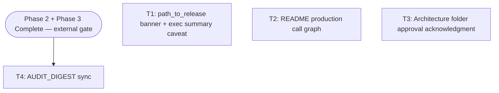

# Plan — phase-5-doc-architecture-hygiene

**Version:** 1.1  
**Status:** Complete  
**Orchestrator skill:** orchestrator-planning v0.6  
**Plan file:** `.dev/plans/phase-5-doc-architecture-hygiene/plan.md`

---

## §0 Context map intake

**Path consumed:** `.dev/plans/phase-5-doc-architecture-hygiene/context-map.md`  
(promoted from `.dev/plans/_pending/phase-5-doc-architecture-hygiene/context-map.md` — all `_pending/` paths in prose below are **retired strings**.)

**Readiness verdict:** CONDITIONAL

**Scope-area labels flagged (ambiguity flags in map):**
- Flag 1 · ownership — path_to_release §1 strategy (banner vs rewrite)
- Flag 2 · ownership — AUDIT_DIGEST edit timing (only after Phase 2+3 merge)
- Flag 3 · ownership — architecture folder approval scope (git already tracks all 11 files)
- Flag 4 · vocabulary_collision — README call graph placement
- Flag 5 · coexisting_model_versions — AUDIT #10 resolution vs G6 / C5
- Flag 6 · missing_test_coverage — no automated doc-drift test (non-blocking)

**Skill version + commit SHA (staleness check):** pre-plan-exploration v0.2 · `ee87002297a495389b9bc79a510966dd30ab23f7`

**CONDITIONAL resolution — orchestrator decisions at planning time (binding for all executors):**

| Flag | Decision | Rationale |
|------|----------|-----------|
| Flag 1 | **Banner approach.** Add a `> **Superseded (2026_04_11):**` blockquote banner at the top of `## 1. CLI — does not exist`, plus a one-sentence caveat in the Executive Summary paragraph striking the "No CLI exists" claim. Full §1 content (wet-run risks 1–5) is **preserved** below the banner. | Preserves informative historical context, is reversible, and costs 3–5 lines. A full §1 rewrite risks losing wet-run notes. Matches MVP_PICKUP §204 recommendation. |
| Flag 2 | **T4 strictly gated on Phase 2 + Phase 3 Complete banners.** No AUDIT table edits before both external plans are marked Complete. | Context map §Orchestrator notes: AUDIT sync on incomplete Phase 2/3 state → false green audit story. |
| Flag 3 | **Approval = user-side review + changelog acknowledgment commit.** All 11 files are already tracked at HEAD (`ee870022`). Executor adds an `[APPROVAL]` entry to `architecture/changelog.md` and bumps `INDEX.md` `Last verified` date. No force-commit of unexpectedly untracked content. | Context map §Orchestrator notes confirm "commit likely means user approval." git ls-files confirms all 11 tracked. |
| Flag 4 | **Add `**Production call graph:**` line at end of the `## Architecture` section body (before `## Evaluation & Testing`), verbatim from `architectural-patterns.md` lines 76–78. Also add a parenthetical sentence to the `**Orchestration**` paragraph clarifying the scratch engine is not on the production request path.** | Context map Surface 5: one-liner without prose caveat leaves contradictory onboarding story. Placement at end of Architecture body avoids rewriting the ASCII diagram or data-path paragraph. |
| Flag 5 | **T4 kill criterion: do NOT move AUDIT #10 to the fixed table unless Phase 3 G6 is explicitly confirmed landed (context map Surface 4 / Flag 5).** Executor must confirm `aria/llm/client.py` bare-except sites are absent before touching row #10. | Surface 4 confirmed coupling: moving #10 while llm/client.py still has bare-except → digest contradicts code. |
| Flag 6 | Deferred. No automated doc-drift test in Phase 5 scope. | Non-blocking per context map annotation. |

**Binding artifacts:** context map at path above (git-tracked since promotion), CHANGELOG.md heading `## 2026_04_11` (confirmed by codebase read). All §2 constraints trace to these tracked sources.

---

## §1 Task statement

Phase 5 closes the documentation and architecture hygiene gaps itemized in `.dev/MVP_PICKUP.md` §204–209 (MVP criterion 6: "docs match code"). Four discrete changes:

1. **path_to_release.md §1 supersession** — the section `## 1. CLI — does not exist` and the Executive Summary's "No CLI exists" sentence are stale since 2026-04-11. A supersession banner is added; the underlying wet-run risks are preserved.
2. **README production call graph** — the `## Architecture` section implies the scratch orchestration engine is on the production request path. The actual runtime path (`HTTP/CLI → aria/services → direct clients`) is added as an explicit `**Production call graph:**` note with a prose caveat on the `**Orchestration**` paragraph.
3. **Architecture folder approval** — `.dev/architecture/aria/` (11 files, all git-tracked at `ee870022`) is acknowledged as reviewed SSOT. The acknowledgment is recorded in `architecture/changelog.md` and `INDEX.md` is stamped with today's `Last verified` date.
4. **AUDIT_DIGEST.md open table sync** — after Phase 2 (phase-2-eval-honesty) and Phase 3 (phase-3-observability) are Complete, the open/partial table is updated: closed rows move to fixed, new Phase 3 fixed rows added, and row #10 is handled per §0 Flag 5 decision.

**Non-goals:**
- Editing path_to_release §2–5 (observability/eval gaps — still accurate enough; Phase 3 owns CHANGELOG for those)
- Adding any automated doc-drift test (Flag 6 deferred)
- Rewriting the full README `## Architecture` section
- Moving, renaming, or editing any of the 11 architecture folder content files
- Any Phase 3 code changes (C5, G5, G6, L1–L8 in `aria/`)
- Phase 4 (`ARIA_PLACEHOLDER_API`, Quickstart live block)
- Phase 6 MVP+

---

## §2 Shared contracts

| Topic | Binding |
|-------|---------|
| **Types / interfaces** | N/A — doc-only phase. No Python symbols introduced or modified. |
| **Error envelope** | N/A |
| **Naming — supersession date format** | All banner text and cross-references MUST use `2026_04_11` (underscores, matching CHANGELOG.md heading `## 2026_04_11`). The string `2026-04-11` (hyphens) must NOT appear in any new banner or link. Confirmed format from codebase read. |
| **Naming — call graph verbatim text** | The production call graph added to README must use the verbatim three-line block from `architectural-patterns.md` lines 76–81 (the fenced block under `## Production call graph (actual runtime)`). Executor may compress to one prose line but must not invent different service names. |
| **Logging** | N/A |
| **Tests** | No executable tests are part of this plan. Kill criteria are verified by the executor via direct file inspection (grep-level spot check). No pytest. |
| **CLI surface** | N/A — no CLI changes. |
| **Decision log paths** | No architectural-tier subtasks in this plan. No decision logs required. |

---

## §3 Dependency DAG



**Parallel group {T1, T2, T3}:** May run in any order or simultaneously. They touch different files with no overlapping symbols.  
**T4:** Blocked on two external gates (Phase 2 Complete AND Phase 3 Complete). No intra-plan dependency on T1/T2/T3, but best run last so the folder is tidy at AUDIT sync time.

---

## §4 Subtask specs

### T1 — Supersession banner on `path_to_release.md` §1

| Field | Content |
|-------|---------|
| **ID** | T1 |
| **Scope** | Add a `> **Superseded (2026_04_11):**` blockquote banner immediately after the `## 1. CLI — does not exist` heading. Add a one-sentence caveat in the `## Executive summary` paragraph striking the "No CLI exists" sentence. All existing content (wet-run risks 1–5, tables, file list) is preserved unchanged below the banner. |
| **Files to touch** | `.dev/path_to_release.md` |
| **Contract bindings** | §2 Naming — supersession date format (`2026_04_11`, underscores). |
| **Inputs** | None |
| **Outputs** | `.dev/path_to_release.md` with banner and exec-summary caveat applied. |
| **Kill criteria** | 1. **Halt** if the CHANGELOG.md heading cannot be confirmed as `## 2026_04_11` before writing the cross-reference (format contract violation). 2. **Halt** if the proposed edit would delete or overwrite any of the five wet-run risk bullets (items 1–5 under "Wet-run risks"). 3. **Halt** if context-map flag 1 is somehow unresolved at execution start — the §0 resolution (banner approach) is binding; do not re-open the fork. |
| **Log tier** | standard |
| **Risks & mitigations** | Context map Surface 7 (suspected): path_to_release §2–3 may also be stale after Phase 3. **Mitigation:** T1 scope is §1 + Executive Summary only; do not touch §2–5. |

---

### T2 — Add production call graph to `README.md`

| Field | Content |
|-------|---------|
| **ID** | T2 |
| **Scope** | (a) Add a `**Production call graph:**` note at the end of the `## Architecture` section body (after the `**Agents**` paragraph, before `## Evaluation & Testing`). Use the verbatim three-line block from `architectural-patterns.md` lines 76–78, formatted as a fenced code block or inline, with a cross-reference to `.dev/architecture/aria/architectural-patterns.md`. (b) Append a parenthetical sentence to the **Orchestration** paragraph: "(The scratch engine is fully tested but is not on the production request path today — `POST /query` and `aria query` route through `aria.services` directly.)" |
| **Files to touch** | `README.md` |
| **Contract bindings** | §2 Naming — call graph verbatim text from `architectural-patterns.md`. |
| **Inputs** | None |
| **Outputs** | `README.md` with call-graph addition and orchestration caveat. |
| **Kill criteria** | 1. **Halt** if the `## Architecture` section cannot be precisely located (line boundaries shifted from what was read). Re-read file before editing. 2. **Halt** if the proposed call-graph line would duplicate or contradict the already-present `## CLI (\`aria\`)` section content. 3. **Halt** if context-map flag 4 ambiguity is somehow unresolved — §0 placement decision (end of Architecture section body) is binding. |
| **Log tier** | standard |
| **Risks & mitigations** | Context map Surface 5 (confirmed): call-graph + orchestration paragraph left contradictory without caveat. **Mitigation:** both edits in same subtask, same file. |

---

### T3 — Architecture folder approval acknowledgment

| Field | Content |
|-------|---------|
| **ID** | T3 |
| **Scope** | Add an `[APPROVAL]` entry to `.dev/architecture/aria/changelog.md` recording that the owner reviewed and acknowledged all 11 files as SSOT. Update `INDEX.md` `Last verified` date to today (2026-05-25). No edits to any of the 11 content files. |
| **Files to touch** | `.dev/architecture/aria/changelog.md`, `.dev/architecture/aria/INDEX.md` |
| **Contract bindings** | None (no new symbols). §0 Flag 3 decision: approval = acknowledgment commit, not content edit. |
| **Inputs** | None |
| **Outputs** | Updated `changelog.md` with approval entry; `INDEX.md` with updated `Last verified` date. |
| **Kill criteria** | 1. **Halt** if any of the 11 content files shows an unexpected unstaged diff at execution time (would indicate in-flight unreviewed changes — obtain user confirmation before proceeding). 2. **Halt** if `git ls-files .dev/architecture/aria/` does not return all 11 expected paths (untracked file would mean §0 Flag 3 assumption is wrong). 3. **Halt** if context-map flag 3 ambiguity is somehow unresolved — §0 decision (approval = changelog entry, no new file force-commits) is binding. |
| **Log tier** | trivial |
| **Risks & mitigations** | Low risk. Only changelog append and index date bump. |

---

### T4 — AUDIT_DIGEST.md open table sync

| Field | Content |
|-------|---------|
| **ID** | T4 |
| **Scope** | After Phase 2 and Phase 3 are Complete: move rows #2, #8, #18, #19, #20 from the open table to the fixed table if their Phase 2 fix is confirmed. Add new fixed rows for any Phase 3 items (G5/G6/L1/L7) that landed. Update `## Recommended execution order` to remove resolved items. Do NOT move AUDIT #10 to fixed unless `aria/llm/client.py` bare-except sites (lines ~237, ~277) are confirmed absent (per §0 Flag 5). |
| **Files to touch** | `.dev/AUDIT_DIGEST.md` |
| **Contract bindings** | §0 Flag 5 decision: row #10 gate. §0 Flag 2 decision: external Phase 2+3 gate is a hard precondition. |
| **Inputs** | Phase 2 plan Complete state (phase-2-eval-honesty), Phase 3 plan Complete state (phase-3-observability). |
| **Outputs** | Updated `AUDIT_DIGEST.md` with accurate open/fixed tables, removal of resolved rows from Recommended execution order. |
| **Kill criteria** | 1. **Halt if Phase 2 plan (`.dev/plans/phase-2-eval-honesty/plan.md`) does not show a `Complete` banner.** 2. **Halt if Phase 3 plan (`.dev/plans/phase-3-observability/plan.md`) does not show a `Complete` banner.** 3. **Halt** if context-map flag 2 is unresolved — §0 decision (no edits before both plans complete) is binding. 4. **Halt** if any proposed table edit for an item cannot be traced to a specific artifact (commit, CHANGELOG entry, or plan §8) in Phase 2 or Phase 3 output. 5. **Halt** if AUDIT #10 move to fixed is proposed while `aria/llm/client.py` still contains bare `except Exception: pass` at the telemetry write call sites (grep check). |
| **Log tier** | standard |
| **Risks & mitigations** | Context map Surface 3 (confirmed): marking #2 fixed while Phase 2 YAMLs still empty → false green. **Mitigation:** kill criterion 1 blocks execution. Context map Surface 4 (confirmed): #10 vs G6 coupling. **Mitigation:** kill criterion 5 + §0 Flag 5 decision. Phase 3 may complete in stages (G1–G4 before G6). **Mitigation:** executor must confirm G6 specifically before touching #10. |

---

## §5 Adversarial pass

*Answered from the packet-only executor persona: an executor receiving only `Tn.md` + executor SKILL.md, with no access to this parent plan.*

### 5.1 Rejected decompositions

- **Full §1 rewrite of `path_to_release.md`**: Would require rewriting 47 lines of stale content and risk silently losing the wet-run risks (items 1–5) that are still informative historical context. The banner approach satisfies MVP criterion 6 ("docs match code") at lower risk. Rejected.
- **Merge T1 + T2 into one "doc hygiene" task**: Two different files, different kill criteria, different risk profiles. Merging makes rollback harder and prevents parallel execution. Rejected.
- **Include path_to_release §2–5 in T1 scope**: Observability and eval gap sections (L1–L8, C1–C6, E1–E8) will be stale after Phase 3 lands, but Phase 3 plan owns those CHANGELOG entries. Only §1 (CLI) is unambiguously stale now. Scope expansion rejected.
- **T3 as a no-op (skip the approval entry)**: G10 in MVP_PICKUP.md explicitly requires "commit or approve `architecture/aria/`." Skipping it leaves G10 open forever. Retained as a trivial but necessary task.

### 5.2 Load-bearing assumptions

*(Required tuple shape: claim | contract surface referenced | failure mode | subtask IDs)*

```
(CHANGELOG heading is 2026_04_11 with underscores
 | §2 Naming row: supersession date format
 | T1 writes wrong format (hyphens) → cross-reference points at non-existent heading slug
 | T1)

(architectural-patterns.md production call graph text is stable at ee870022
 | §2 Naming row: call graph verbatim text from architectural-patterns.md lines 76–78
 | T2 inserts stale or wrong call graph text → README claims contradict patterns file
 | T2)

(All 11 architecture folder files are git-tracked with no unstaged diffs at execution time
 | T3 kill criterion 2: git ls-files check
 | T3 adds approval entry for files that were silently modified → false SSOT status
 | T3)

(Phase 2 plan and Phase 3 plan will eventually reach Complete status
 | T4 kill criteria 1+2
 | T4 never executes if either plan stalls → AUDIT_DIGEST stays stale indefinitely
 | T4)

(AUDIT #10 move to fixed requires G6 landing; G6 ≠ "Phase 3 Complete" unless all Phase 3 goals include G6
 | §0 Flag 5 decision + T4 kill criterion 5
 | T4 prematurely moves #10 if Phase 3 Complete banner does not distinguish partial vs full completion
 | T4)
```

### 5.3 Highest re-plan risk

**T4 (AUDIT_DIGEST sync):** Depends on two external plans completing, and the G6/#10 coupling means a partial Phase 3 landing (G1–G4 but not G6) would require the executor to make a fine-grained judgment on scope. The kill criterion is strict but Phase 3 may complete in stages. *Also a process risk:* Phase 3 may mark itself Complete without explicitly documenting G6 status — executor must grep `aria/llm/client.py` independently, not rely solely on the Phase 3 Complete banner.

### 5.4 Hidden couplings

*(Required tuple shape: claim | contract surface referenced | failure mode | confirmed/suspected | subtask IDs)*

```
(Banner date format inconsistency between T1 and any future README cross-link
 | §2 Naming row: 2026_04_11 (underscores) binding for both T1 and T2
 | T1 writes 2026_04_11; a future editor of README writes 2026-04-11 → two inconsistent references
 | suspected (T2 doesn't cross-link the banner, so coupling is latent not immediate)
 | T1, T2)

(README Architecture Orchestration paragraph vs production call graph contradiction
 | README.md ## Architecture **Orchestration** paragraph ↔ T2-added call graph block
 | T2 adds call graph without caveating Orchestration paragraph → two contradictory statements in same section
 | confirmed
 | T2)

(AUDIT #10 fixed claim vs aria/llm/client.py bare-except sites
 | AUDIT_DIGEST.md fixed table row #10 ↔ aria/llm/client.py:~237,~277
 | T4 prematurely moves #10 fixed → AUDIT claims what code still does not do
 | confirmed
 | T4)

(path_to_release §4 E1 claim vs Phase 2 outcome after T4 closes AUDIT #2
 | AUDIT_DIGEST open #2 ↔ path_to_release.md §4 E1 ↔ MVP_PICKUP.md G1
 | T4 closes #2 in AUDIT while path_to_release §4 still narrates empty-context failure — T1 banner covers §1 only
 | suspected (T1 scope deliberately excludes §4; residual inconsistency is post-MVP cleanup)
 | T1, T4)
```

---

## §6 Executor packets

Packets saved to `.dev/plans/phase-5-doc-architecture-hygiene/packets/`:

- `T1.md` — path_to_release banner
- `T2.md` — README call graph
- `T3.md` — architecture folder approval
- `T4.md` — AUDIT_DIGEST sync

Each packet is self-contained (§1 task statement + §2 contracts + subtask block + filtered §5 items + resolved inputs). See packet files.

---

## §7 Amendment subtasks

*(None at v1.0. To be added if auditor findings require targeted fixes after Complete.)*

---

## §8 Auditor handoff

### §8.1 Completion snapshot

- **Implementation SHA:** `153a51f7eedad3ff71e894928dff89ce47bb4dee` (T4; T1–T4 landed in order `614fcf2` → `855abcb` → `4fe003b` → `153a51f`)
- **Closure SHA:** commit containing this plan file at **Version:** 1.1 · **Status:** Complete (§8 block)
- **Working tree:** clean at implementation SHA (`153a51f`); verification below run before plan closure edit
- **Verification (clean checkout at `153a51f`; doc-only plan per §2 Tests — grep contract checks, no pytest):**

  PowerShell one-shot (9 checks, exit 0 = pass):

  ```powershell
  $fail = 0
  if (-not (Select-String -Path .dev/path_to_release.md -Pattern 'Superseded \(2026_04_11\)' -Quiet)) { $fail++ }
  if (Select-String -Path .dev/path_to_release.md -Pattern '2026-04-11' -Quiet) { $fail++ }
  if (-not (Select-String -Path README.md -Pattern 'Production call graph:' -Quiet)) { $fail++ }
  if (-not (Select-String -Path README.md -Pattern 'not on the production request path' -Quiet)) { $fail++ }
  if (-not (Select-String -Path .dev/architecture/aria/changelog.md -Pattern '\[APPROVAL\]' -Quiet)) { $fail++ }
  if (-not (Select-String -Path .dev/architecture/aria/INDEX.md -Pattern 'Last verified:    2026-05-25' -Quiet)) { $fail++ }
  if (-not (Select-String -Path .dev/AUDIT_DIGEST.md -Pattern '\*\*2\*\*.*retrieval goldens' -Quiet)) { $fail++ }
  if (-not (Select-String -Path .dev/AUDIT_DIGEST.md -Pattern 'G6.*LLM client' -Quiet)) { $fail++ }
  if (Select-String -Path aria/llm/client.py -Pattern 'except Exception: pass' -Quiet) { $fail++ }
  exit $fail
  ```

  **Result:** 9/9 passed, exit code 0 (2026-05-30)

### §8.2 Artifact chain

| Order | Path |
|-------|------|
| 1 | `.dev/plans/phase-5-doc-architecture-hygiene/context-map.md` (scout SHA `ee870022`; stale vs implementation — see §Post-execution note below) |
| 2 | `.dev/plans/phase-5-doc-architecture-hygiene/plan.md` (v1.1 + §8) |
| 3 | `.dev/plans/phase-5-doc-architecture-hygiene/packets/T{1..4}.md` |
| 4 | `CHANGELOG.md` § phase-5-doc-architecture-hygiene |
| 5 | `.dev/path_to_release.md` (T1 banner + exec summary) |
| 6 | `README.md` (T2 call graph + orchestration caveat) |
| 7 | `.dev/architecture/aria/changelog.md`, `.dev/architecture/aria/INDEX.md` (T3 approval) |
| 8 | `.dev/AUDIT_DIGEST.md` (T4 sync) |
| 9 | `.dev/architecture/aria/architectural-patterns.md` (T2 verbatim source) |
| 10 | External gates: `.dev/plans/phase-2-eval-honesty/plan.md` (Complete), `.dev/plans/phase-3-observability/plan.md` (Complete) |

All paths must resolve via `git show HEAD:<path>` at the §8.1 closure SHA.

**Context-map staleness (post-execution):** Map §Orchestrator handoff notes (lines 217–219) still describe pre-Phase-3 code (`except Exception: pass`, missing G5 histograms). Implementation SHA `153a51f` supersedes those notes for AUDIT #10 / G6 / G5 state. Auditor: treat map scout claims as historical; verify against code and AUDIT fixed tables at closure SHA.

### §8.3 §2 evidence (per-row)

| §2 row | Landed artifact | Test / check |
|--------|-----------------|--------------|
| Types / interfaces | N/A (doc-only) | — |
| Error envelope | N/A | — |
| Naming — supersession date `2026_04_11` | `.dev/path_to_release.md:17` banner; exec summary strike-through `:11` | Grep: `Superseded (2026_04_11)` present; no `2026-04-11` in file; `CHANGELOG.md` heading `## 2026_04_11` at `:109` |
| Naming — call graph verbatim text | `README.md:34-38` fenced block | Byte match to `architectural-patterns.md:76-78`; cross-ref link at `README.md:32` |
| Logging | N/A | — |
| Tests (grep spot-check policy) | §8.1 PowerShell script | 9/9 passed at `153a51f` |
| CLI surface | N/A | — |
| Decision log paths | N/A (no architectural tier) | — |

**Subtask landed commits:**

| Subtask | Commit | Files |
|---------|--------|-------|
| T1 | `614fcf2` | `.dev/path_to_release.md`, `CHANGELOG.md` |
| T2 | `855abcb` | `README.md` |
| T3 | `4fe003b` | `.dev/architecture/aria/INDEX.md`, `.dev/architecture/aria/changelog.md`, `CHANGELOG.md` |
| T4 | `153a51f` | `.dev/AUDIT_DIGEST.md`, `CHANGELOG.md` |

### §8.4 §5 disposition

| Item | Status | Notes |
|------|--------|-------|
| §5.2 CHANGELOG heading `2026_04_11` | **closed** | T1 cross-ref; heading confirmed at `CHANGELOG.md:109` |
| §5.2 architectural-patterns call graph stable | **closed** | README block matches `architectural-patterns.md:76-78` |
| §5.2 11 architecture files tracked, no unstaged diffs | **closed** | T3 commit; `git ls-files .dev/architecture/aria/` → 12 paths (11 section files + INDEX/changelog) |
| §5.2 Phase 2 + Phase 3 reach Complete | **closed** | Both plans show **Status:** Complete; T4 executed |
| §5.2 AUDIT #10 vs G6 coupling | **closed** | Zero `except Exception: pass` in `aria/llm/client.py`; AUDIT #10 resolution cites Phase 3 G6 (`AUDIT_DIGEST.md:64`) |
| §5.3 highest re-plan risk (T4 partial Phase 3) | **closed** | T4 left #19/#20 open (no artifact); #10 updated not false-green; no replan |
| §5.4 banner date format T1/T2 latent coupling | **treat-as-prediction** | T1 uses underscores; T2 does not cross-link banner — auditor grep if README later cites supersession date |
| §5.4 README orchestration vs call graph | **closed** | T2 landed both caveat (`README.md:28`) and call graph (`README.md:32-40`) |
| §5.4 AUDIT #10 vs llm/client.py | **closed** | G6 landed Phase 3; T4 updated fixed table row #10 |
| §5.4 path_to_release §4 E1 vs AUDIT #2 | **open** | Deliberate non-goal (T1 §1-only scope); path_to_release §4 still narrates empty-context eval gap while AUDIT #2 marked fixed — post-MVP doc cleanup |
| Flag 6 automated doc-drift test | **open** | Deferred per §0; documented in CHANGELOG T1–T4 coverage gaps; does not block merge |

### §8.5 Cold-read seeds

1. `.dev/path_to_release.md` (T1 banner + preserved wet-run risks 1–5)
2. `README.md` § Architecture (T2 orchestration caveat + production call graph)
3. `.dev/AUDIT_DIGEST.md` open table + Phase 2/3 fixed tables (T4 sync accuracy)
4. `.dev/architecture/aria/architectural-patterns.md` § Production call graph (T2 verbatim source)
5. `aria/llm/client.py` (AUDIT #10 / G6 gate — confirm no silent telemetry swallows)
